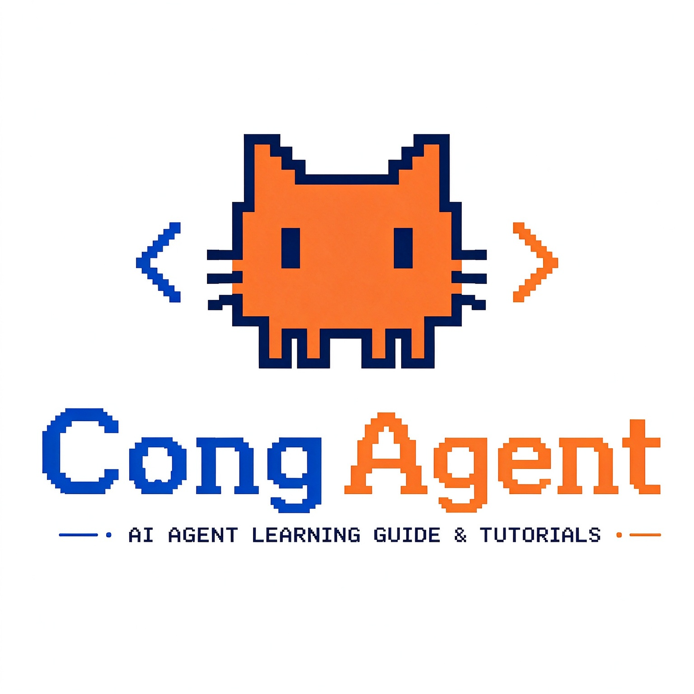
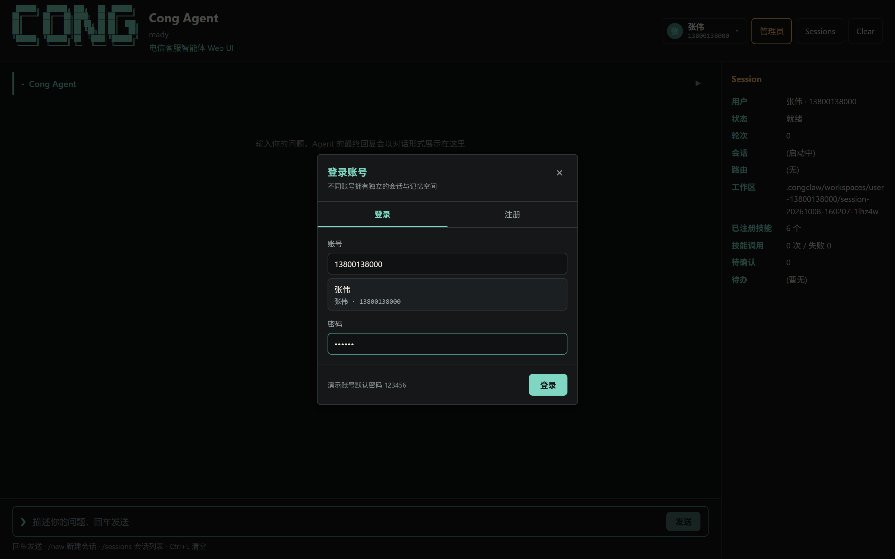
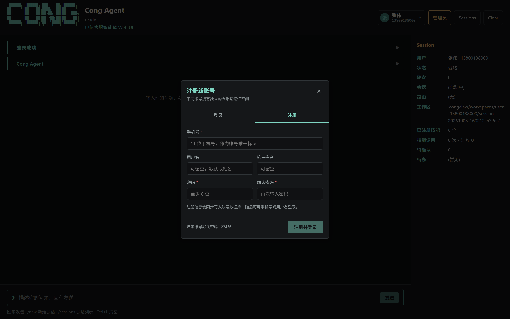

<p align="center">
  
</p>

<h1 align="center">智服·电信智能客服Agent系统 </h1>

<p align="center">
  FastAPI + LangGraph 双引擎客服 Agent：RAG 快速检索保响应速度，Agent 深度推理保复杂业务处理能力。<br/>
  自带 Vue 3 Web UI，全部业务能力均可在浏览器中直接演示；<br/>
  回合结束后自动把可复用的常见问答沉淀为 FAQ 库，人工审核发布后回流知识库。
</p>

## 项目简介

本项目**电信客服业务智能体**，面向四类高频场景的多轮对话：

| 业务场景 | 示例 | 承接引擎 |
| --- | --- | --- |
| 基础业务咨询 | "5G 畅享套餐包含多少流量？" | RAG 快速检索子图 |
| 余额/账单查询 | "我还有多少钱话费？" | Agent 深度推理子图 |
| 故障报修 | "我家宽带从昨天开始断网" | Agent 子图（建单 + 查状态多工具并行） |
| 业务办理 | "帮我把套餐升级成 199 档" | Agent 子图（人工确认后执行） |

对话管控：意图模糊最多 **5 轮**追问澄清，超轮或无关请求（"写首诗"）自动兜底；支持指代消解（"那这个多少钱？"→ 完整问句重写）、跨会话长期用户摘要。

在此之上还有一条**知识自增长闭环**：每轮对话结束后判定本轮是否值得沉淀为可复用的常见问答，通过则落库为待审 FAQ 条目，人工在后台审核发布后把已发布条目回流知识库——被反复问到的问题会逐步长成 RAG 的稳定知识来源。

## 系统架构

```text
┌────────────────────────────────────────────────────────────────┐
│ 接入层                                                         │
│   Web UI（Vue 3）  CLI / TUI 客户端 ──HTTP/SSE──> FastAPI 服务 │
│   /chat  /skills  /knowledge/ingest  /eval/run  /health        │
│   /auth  /sessions  /users  /admin（db+rag 管理）  /faq（FAQ） │
├────────────────────────────────────────────────────────────────┤
│ 编排层（LangGraph 主图，全链路原生 async）                     │
│                                                                │
│  query_rewrite（指代消解）→ intent_router（五路意图分流）      │
│       │                                                        │
│       ├─ rag_query   → rag_subgraph（RAG 快查，见下图）        │
│       ├─ agent_service → agent_subgraph（深度推理）            │
│       │     think → act（多工具 asyncio.gather 并行）→ reflect │
│       ├─ clarify（追问澄清，clarify_count ≤ 5）                │
│       └─ fallback（兜底话术 + 服务边界引导）                   │
│       ↓ 四类分支统一经 sediment_route（沉淀门控条件边）判定    │
│  faq_sediment（常见问答沉淀子图）                              │
│       rule_gate → match_existing → extract → persist           │
│       ↓ 落库 draft 待审 → 人工审核发布 → reflow 回流知识库     │
├────────────────────────────────────────────────────────────────┤
│ 能力层                                                         │
│  RAG 检索子图                     │ Skill 工具集（热插拔）     │
│   START ─┬─ retrieve_bm25 ─┐      │ query_balance    余额查询  │
│        └─ retrieve_dense ┘并行    │ query_package    套餐余量  │
│        ↓ rrf_fusion（RRF 融合）   │ list_packages    套餐列表  │
│        ↓ rerank（Cross-Encoder）  │ report_fault     故障建单  │
│        ↓ evidence_gate（条件边）  │ query_fault_status 工单进度│
│        ├ 命中 → parent_lookup     │ change_package   套餐变更  │
│        │ （父分片回溯+邻域扩展）  │  （写操作，需人工确认）    │
│        │   → generate（附来源）   │ 目录监听热加载，增删即生效 │
│        ├ 空/低置信 → rewrite_once │                            │
│        └ 仍无 → rag_fallback      │                            │
├────────────────────────────────────────────────────────────────┤
│ 记忆层                                                         │
│   短期：会话窗口 + 当前意图 + 待确认槽位（SQLite session 表）  │
│   长期：用户摘要（咨询主题/在办工单/偏好套餐，user_profile）   │
│   四层提示词组装：系统提示词 → 记忆 → 检索证据 → 用户问题      │
├────────────────────────────────────────────────────────────────┤
│ 数据层（本地轻量，零外部服务依赖）                             │
│   Milvus Lite（child 向量）  SQLite + WAL（元信息/会话/工单）  │
│   BGE-M3（本地 embedding）       bge-reranker（本地精排）      │
├────────────────────────────────────────────────────────────────┤
│ 评测层                                                         │
│   trace 采集 → 归一化 → 规则校验（分流/参数/兜底/轮次/沉淀）   │
│   → LLM-Judge（质量/逻辑/合规 1~5 分）→ eval/reports/*.md      │
└────────────────────────────────────────────────────────────────┘
```

双引擎分工：意图识别把"知识型问题"分流到 RAG 子图（保速度），把"业务办理型请求"分流到 Agent 子图（保能力）。两个子图都是独立编译的 LangGraph `StateGraph`，主图只与它们做"问句进、答案出"的交互，每个检索/推理步骤天然进入 trace，直接作为评测流水线的轨迹数据。

第三条链路是**沉淀旁路**：四类分支不再直接结束，而是先经 `sediment_route` 条件边判定"本轮值不值得沉淀"。门控不通过就连子图都不进（零 LLM 调用）；通过则进入 `faq_sediment` 子图走 `rule_gate → match_existing → extract → persist` 落库。审核发布后，全部已发布条目被整份重渲染为 `knowledge/FAQ沉淀库.md` 并走同一套离线入库管线，于是"对话 → 沉淀 → 审核 → 回流知识库"形成闭环。

## 快速开始

### 1. 环境准备

后端使用 [uv](https://docs.astral.sh/uv/) 管理 Python 环境（Python 3.13+）：

```bash
uv sync
```

下载本地模型（BGE-M3 + bge-reranker 到 `models/`）：

```bash
uv run python scripts/download_models.py
uv run python scripts/smoke_models.py   # 冒烟：输出 1 条向量 + 1 个 rerank 分数
```

### 2. 配置 `.env`

```text
API_KEY=...            # ChatOpenAI 兼容配置
MODEL=...
BASE_URL=...

DB_PATH=data/telecom_cs.db
MILVUS_DB_PATH=data/milvus_lite.db      # 中文路径下 faiss 索引异常时指向纯英文路径
EMBED_MODEL_PATH=models/bge-m3
RERANK_MODEL_PATH=models/bge-reranker
KNOWLEDGE_DIR=knowledge

# RAG 检索参数（可选，均有默认值）
RAG_RECALL_TOP_K=10
RAG_RERANK_INPUT_TOP_N=8                # CPU 上精排成本与候选数线性，8 时 P95≈2.4s
RAG_RERANK_TOP_K=5
RAG_RERANK_GATE_PROB=0.53               # 证据门阈值（按实测分布校准）
RAG_RERANK_GATE_RAW=0.15
RAG_PREWARM=1                           # 服务启动后台预热模型，消除首请求冷启动

# Skill 热插拔
SKILLS_EXTRA_DIR=data/skills            # 外部 Skill 目录
SKILL_WATCH=1                           # 目录监听开关
SKILL_WATCH_INTERVAL=2

# 常见问答沉淀（可选，默认开启）
CONG_FAQ_SEDIMENT=1                     # 置 0 则回合结束不做任何沉淀判定与调用
```

完整示例见 [.env.example](./.env.example)。

### 3. 初始化知识库

```bash
uv run python -m congclaw.db           # 幂等建库 data/telecom_cs.db
uv run python -m congclaw.rag          # 入库 knowledge/ 全部文档（32 份，426 child 分片）
uv run python -m congclaw.rag --stats  # 查看知识库规模
```

> 建库脚本一次性写入演示业务数据（张伟 13800138000 / 余额 86.50 / 当前套餐 5G畅享129元档 等）。

知识库支持**增量同步**，只处理真正变化的文档（sha256 指纹清单落在 `data/knowledge_manifest.json`）：

```bash
uv run python scripts/watch_knowledge.py --status    # 干跑：只看新增/修改/删除，不入库
uv run python scripts/watch_knowledge.py             # 同步一次：增量入库 + 清理已删除来源
uv run python scripts/watch_knowledge.py --watch     # 常驻监听，按间隔自动同步
```

### 4. 启动后端服务

```bash
uv run uvicorn congclaw.api.main:app --host 127.0.0.1 --port 8000
```

启动时自动：建库（幂等）→ Skill 注册中心扫描 + 目录监听 → 后台预热 BGE 模型。健康检查：

```bash
curl http://127.0.0.1:8000/health
```

### 5. 启动 Web UI

另开一个终端：

```bash
cd ui
npm install
npm run dev
```

浏览器打开终端输出的地址（默认 `http://localhost:5173/`，端口被占用时 Vite 会自动递增，以终端输出为准）。前端通过 Vite 代理把 `/api` 转发到 `http://127.0.0.1:8000`，因此**后端必须先启动**。

### 6. 运行测试

```bash
uv run pytest -q        # 335 条全绿
```

## 界面一览

打开 `http://localhost:5173/` 即可看到主界面：顶部是品牌区与账号/会话/清空操作，中间是对话区（用户提问 + 思考过程折叠卡 + Agent 回复气泡），右侧是实时 Session 面板（用户、状态、轮次、会话 ID、路由、工作区、已注册技能、技能调用次数、待确认、待办）。


## 功能演示（分步界面截图）

以下截图均在演示号码 **13800138000（张伟）** 上按顺序实操录制。

### 1. 账号体系：切换用户 / 登录 / 注册

系统内置 8 个演示账号，每个账号拥有**独立的工作区、会话与长期记忆**，互不串号。

**① 展开账号下拉**：点击右上角用户区，可见全部已注册账号，"张伟"当前身份带 `✓ 当前` 标记。


**② 打开登录弹窗**：点击「登录其他账号」。


**③ 输入凭据**：支持手机号或用户名登录，演示账号默认密码 `123456`。



**④ 登录成功**：顶部身份随即切换，对话区出现「登录成功」提示，并自动为该用户分配新的会话工作区。


**⑤ 注册新账号**：在账号下拉中点击「注册新账号」，手机号与密码为必填项，注册成功后直接登录并写回账号数据库。



### 2. 余额查询（Agent 单工具）

在输入框输入 `帮我查一下话费余额`，回车发送。

意图分流 `agent_service` → think 决定调用 `query_balance` → 返回账户余额与本月实时话费 → reflect 校验通过。右侧面板同步显示轮次、会话 ID、路由 `agent_loop` 与技能调用次数。


**展开思考过程**：点击「思考过程 19 步」可展开本轮全部中间事件（profile_loaded、query_rewrite、intent_router、agent_start、技能调用、技能返回……），每一步都可单独展开查看细节，用于演示全链路可观测性。


### 3. 套餐咨询（RAG 检索）

输入 `5G畅享套餐包含多少流量？`。

意图分流 `rag_query` → BM25 ∥ 稠密向量双路并行召回 → RRF 融合 → Cross-Encoder 精排 → 父分片回溯 → 生成答案。右侧 Session 面板的路由变为 `rag_answer`，答案中带来源片段编号。


### 4. 故障报修（追问澄清 → 建单）

**① 信息不足时先追问**：输入 `我家宽带突然不能上网了，帮我报修`，槽位缺失时 Agent 不会直接建单，而是追问上门地址与故障现象（对话管控：模糊追问最多 5 轮）。


**② 补全信息后建单**：接着输入 `地址是北京市海淀区中关村大街1号院3号楼502室，从今天早上8点开始光猫亮红灯，家里所有设备都连不上网。`，Agent 调用 `report_fault` 建单，返回工单号、故障类型、报修地址、联系电话与当前状态。


### 5. 套餐变更（写操作 + 人工确认）

`change_package` 属于高危写操作：Agent 会先落 `pending_approval` 并推送确认话术，**用户确认后**才真正执行。

**① 提出办理诉求**：输入 `帮我把套餐改成199元的5G畅享套餐`，Agent 复述目标套餐与生效规则，并提示「回复『确认』继续办理，回复『取消』放弃本次变更」，此时**不会**改动数据。


**② 确认后真正执行**：输入 `确认办理`，Agent 调用 `change_package` 完成变更，返回原套餐/新套餐、套餐权益、生效时间与办理状态。


> ⚠️ **演示前请重置数据**：套餐变更会真实改写 `user_package` 表，重复演示时第二次会返回"当前已是该套餐，无需重复变更"。重新演示前，可在后台管理界面把 `13800138000` 改回 `P129 / 5G畅享129元档`（见下文「后台数据库管理」），或执行 `uv run python -m congclaw.db` 后手动改回种子值。

### 6. 会话管理（历史会话与新建）

点击顶部的 `Sessions` 按钮（或 `Ctrl+S`），可查看当前用户的全部历史会话：会话 ID、更新时间、末轮路由、轮次、末次提问，当前会话带「当前」标记。点击任意条目即可切换并回放该会话的历史消息，`+ 新建会话` 可为同一用户开启独立的工作区。


### 7. 后台管理 · 数据库管理

**① 管理员验证**：点击顶部橙色「管理员」按钮，输入管理员密码（演示密码 `123456`）。


**② 数据表浏览**：进入后台后可看到全部业务表（account、package_catalog、user_package、fault_ticket、session、user_profile、chunk_meta、pending_approval、faq_entry、app_meta），左侧切换表、右侧支持搜索 / 重置 / 新增一行，主键列带 `PK` 标记，每行可编辑或删除。


**③ 行编辑**：点击任意行的「编辑」，按表结构动态生成字段表单，保存后直接写回 SQLite。


### 8. 后台管理 · RAG 知识库管理

**① 概览与入库**：切换到「RAG 知识库管理」页签，顶部展示 SQLite 分片数、Milvus 向量数、知识来源数；下方支持「按路径入库 / 全量入库 / 上传并入库」，并列出全部知识来源文档及其分片数。


**② 分片预览**：点击任意来源行（或「查看分片」），可查看该文档的父分片与子分片全文，用于演示父子分片 RAG 的分层结构。


### 9. 常见问答沉淀（后台管理 · FAQ 沉淀库）

每轮对话结束后，主图都会经 `sediment_route` 条件边判定本轮是否值得沉淀。只有**路由为 `rag_answer` / `agent_loop`、有实质结果、非兜底、无未决人工确认、问句 ≥ 6 字且不含隐私信息**的回合才会进入沉淀子图；不通过则连子图都不进，零 LLM 调用。

**① 沉淀链路出现在思考过程里**：展开余额查询的思考过程并滚到底部，可见沉淀事件链 `faq_sediment_start → faq_gate → faq_match → faq_sediment_decision`。本例被判定为**跳过**——"我的余额是多少"是个人实时数值，不具备通用性，链路照走但不落库；换成"欠费停机后多久复机"这类通用问题就会落库。


**② FAQ 沉淀库页签**：切到后台管理第三个页签，顶部统计卡片展示「沉淀条目 / 待审核（草稿）/ 已通过已发布 / 覆盖分类」；筛选条支持按**状态、分类、关键词**查询，并提供「重跑回流」手动重试入口；表格列出每条 FAQ 的 ID、标准问句、分类、合并次数、置信度、状态与行内操作（详情 / 通过 / 发布 / 归档）。


**③ 条目详情与溯源**：点击「详情」，可见标准问句、同义问法（供相似问召回）、解决方案正文、适用前提、关联技能，以及来源路由 / 来源会话 / 来源轮次的溯源信息——沉淀的每条知识都能追回它是从哪一轮对话长出来的。


**④ 审核发布与回流**：条目状态按 `draft（待审核）→ approved（已通过）→ published（已发布）→ archived（已归档）` 流转。当操作触及**已发布**集合时（发布新条目，或把已发布条目归档下架）自动触发回流：把当前全部已发布条目整份重新渲染为 `knowledge/FAQ沉淀库.md` 并走离线入库管线，按 `doc_source` 幂等覆盖；回流失败**不阻断**审核结果，可用「重跑回流」或 `POST /api/v1/faq/reflow` 显式重试。


回流后回到对话区，用沉淀进去的问法提问即可命中这条新知识，右侧 Session 面板的路由为 `rag_answer`、答案带来源——**沉淀库至此真正变成了知识库的一部分**。

### 对话管控演示

在 Web UI 输入框中直接输入即可：

- 模糊追问："我想换个更划算的" → 追问澄清，最多 5 轮，第 5 轮仍不清自动兜底。
- 无关请求："帮我写首诗" → 直接兜底，礼貌说明服务边界并引导回四类业务。
- 指代消解："那这个多少钱？" → 查询重写节点补全为完整问句后检索。

## CLI / TUI 演示（备选接入方式）

Web UI 之外，仓库仍保留 Rich CLI 与 Textual TUI 两个 HTTP/SSE 客户端，适合无浏览器环境：

```bash
uv run congclaw "帮我查一下话费余额"        # 单轮 CLI
uv run congclaw tui                        # 多轮 TUI
uv run congclaw --approval-mode inline tui # 指定审批策略
```

审批模式支持 `inline`（默认询问）/ `auto`（自动批准，演示用）/ `deny`（一律拒绝）。CLI/TUI 与 Web UI 走同一个后端，因此沉淀、回流等能力完全一致，只是审核动作在 Web UI 后台管理里操作更直观。

## Skill 热插拔演示

服务运行中向外部 Skill 目录（默认 `data/skills/`）新增一个 Skill 文件，无需重启即被注册中心发现并可在下一轮对话调用：

```bash
# 方式一：API 热注册
curl -X POST http://127.0.0.1:8000/api/v1/skills -H "Content-Type: application/json" -d @new_skill.json

# 方式二：直接往 data/skills/ 目录写 .py 文件，watcher 线程按 SKILL_WATCH_INTERVAL 轮询发现
curl http://127.0.0.1:8000/api/v1/skills          # 查看当前 Skill 列表
curl -X DELETE http://127.0.0.1:8000/api/v1/skills/{name}   # 热卸载
```

## 自动化评测

一键跑 30 条标注评测集（四类业务 + 模糊 + 无关），自动输出含规则校验 + LLM-Judge 的 Markdown 报告：

```bash
curl -X POST http://127.0.0.1:8000/api/v1/eval/run
curl http://127.0.0.1:8000/api/v1/eval/reports          # 报告列表
curl http://127.0.0.1:8000/api/v1/eval/reports/{id}     # 报告详情
```

报告输出到 `eval/reports/`，包含通过率、LLM-Judge 分项得分（答案质量/推理逻辑/话术合规 1~5 分）、失败用例归因，每条失败用例可回链原始 trace 轨迹（`.congclaw/traces/{trace_id}/`）。评测同时消费沉淀事件（`faq_sediment_saved`），可看到哪些回合真的沉淀成了知识。

## 服务接口一览

| 接口 | 方法 | 说明 |
| --- | --- | --- |
| `/api/v1/chat` | POST（SSE） | 多轮对话主入口，流式返回 |
| `/api/v1/auth/login`、`/register`、`/accounts` | POST/GET | 账号登录、注册、账号检索 |
| `/api/v1/users` | GET | 账号列表（前端用户切换下拉） |
| `/api/v1/sessions` | GET | 历史会话列表（支持按用户工作区前缀过滤） |
| `/api/v1/sessions/{id}` | GET | 单会话详情（含 recent_turns，用于历史回放） |
| `/api/v1/admin/login` | POST | 管理员口令校验 |
| `/api/v1/admin/db/tables`、`/rows` | GET/POST/PUT/DELETE | 后台数据表浏览与增删改 |
| `/api/v1/admin/rag/stats`、`/sources`、`/ingest`、`/upload` | GET/POST | 后台 RAG 知识库统计、来源列表、入库、上传 |
| `/api/v1/faq` | GET | FAQ 沉淀库列表（按状态/分类/关键词过滤） |
| `/api/v1/faq/stats` | GET | 沉淀库统计（条目数 / 待审核 / 已发布 / 覆盖分类） |
| `/api/v1/faq/{faq_id}` | GET | 单条 FAQ 详情（含同义问法与溯源） |
| `/api/v1/faq/{faq_id}/status` | PUT | 审核状态流转，触及已发布集合时自动回流 |
| `/api/v1/faq/reflow` | POST | 手动重跑回流（失败返回 500，便于显式重试） |
| `/api/v1/skills` | GET/POST/DELETE | Skill 列表、热注册、热卸载 |
| `/api/v1/knowledge/ingest` | POST | 知识库文档解析入库（另含 `/ingest/upload`、`/stats`） |
| `/api/v1/eval/run` | POST | 触发评测流水线 |
| `/api/v1/eval/reports/{id}` | GET | 获取评测报告 |
| `/health` | GET | 健康检查 |

## 目录结构

```text
CongAgent/
├─ src/congclaw/
│  ├─ api/            # FastAPI app、路由（chat/auth/sessions/users/skills/knowledge/eval/admin/faq）
│  ├─ graph/          # 客服对话主图：state/nodes/workflow/memory/profile_store
│  ├─ rag/            # RAG 子图：parsing/ingest 离线入库 + state/nodes/workflow 在线检索
│  │                  #   retrieval（BM25/稠密/精排）store（SQLite 父子分片）vectorstore（Milvus）
│  ├─ agent/          # Agent 推理子图：think / act（并行工具编排）/ reflect
│  ├─ faq/            # 常见问答沉淀子图：gate（门控规则）/nodes（判重·抽取·落库）/store/reflow/workflow
│  ├─ skills/         # Skill 基类、registry 动态注册中心、catalog 六个业务 Skill
│  ├─ eval/           # 评测流水线：collector/normalizer/rule_checks/llm_judge/report/runner
│  ├─ db/             # SQLite 异步引擎（aiosqlite + WAL）、schema.sql、ORM 模型
│  ├─ core/           # trace、approval、checkpoint、session（SQLite 持久化）
│  ├─ prompts/        # 意图识别/查询重写/RAG/Agent 思考与反思/FAQ 沉淀抽取 prompt
│  ├─ providers/      # ChatOpenAI 兼容 LLM 创建
│  └─ cli/            # HTTP/SSE 演示客户端（Rich CLI + Textual TUI）
├─ ui/                # Vue 3 + Vite Web UI（对话、账号、会话、后台管理三页签）
├─ knowledge/         # 电信知识库原始文档（套餐/资费/宽带/常见问答 FAQ，md/html/txt）
│                     #   FAQ沉淀库.md 为回流产物，由审核发布自动重渲染，不要手工编辑
├─ models/            # BGE-M3、bge-reranker 本地模型
├─ data/              # telecom_cs.db、milvus_lite.db、外部 skills 目录、增量同步指纹清单
├─ docs/images/ui/    # README 使用的 Web UI 分步截图
├─ eval/reports/      # 评测报告输出
├─ scripts/           # 模型下载/冒烟、Milvus Lite 验证、知识库增量同步（watch_knowledge.py）
└─ tests/             # 335 条用例：意图分流/RAG 子图/Skill 热插拔/记忆/评测/FAQ 沉淀/端到端
```

## 关键设计说明

- **LangGraph 子图化**：RAG 与 Agent 均为独立编译的 `StateGraph` 子图，主图条件边挂载。检索全流程（并行召回→融合→精排→证据门→回溯→生成）图节点化，每步可独立观测、条件回退用条件边表达而非业务 if-else。
- **并行召回**：`START` 双出边 fan-out 到 `retrieve_bm25` / `retrieve_dense`，由 LangGraph 调度器并发执行，等价于 `asyncio.gather` 但天然进入 trace。
- **父子分片**：Child（1~3 句）保障召回精度，命中后回溯 Parent 段落块 + 前后邻域 child 扩展 + 去重合并，保障生成上下文完整无断句。
- **证据门校准**：reranker 概率/原始分双阈值（prob≥0.53 且 raw≥0.15，按实测分布校准），库外问题走 `rewrite_once`（限 1 次）→ `rag_fallback`，避免死循环。
- **业务写操作人工确认**：`change_package` 标记 `requires_confirmation`，执行前落库 `pending_approval` 并向用户推送确认话术，用户回复「确认」后才真正执行；下一轮进入 `approval_resumed` 分支续跑。
- **沉淀门控单一口径**：主图条件边 `sediment_route` 与子图首节点 `rule_gate` 共用 [gate.py](./src/congclaw/faq/gate.py) 的同一份判定——路由白名单、有实质结果、非兜底、无未决确认、问句≥6 字、无隐私特征。不通过则**根本不进子图**，既省 LLM 调用，也杜绝把"我的余额是多少"这类个人事实沉淀成知识；纯审批轮（"确认"）会回溯到上一轮真实诉求再沉淀。
- **回流幂等**：审核触及已发布集合时，把全部已发布条目整份重渲染为 `knowledge/FAQ沉淀库.md` 再按 `doc_source` 覆盖入库——归档条目因不再出现于重渲染结果而随之清除，无需单独删除逻辑；渲染时每条 FAQ 收紧为一个连续段落，保证父分片同时含问题与答案。
- **按用户的会话与记忆隔离**：每位用户拥有独立工作区前缀 `.congclaw/workspaces/user-<phone>/`，会话列表按前缀过滤，长期记忆按号码维度落 `user_profile`。
- **热插拔注册中心**：`dict[路径→注销时 mtime]` 语义——内置 Skill 注销后文件内容变更自动恢复；外部 Skill 增删改经 watcher 轮询即生效。
- **性能**：本地 CPU 热身后单轮检索中位 2.06s / P95 2.41s（`RAG_RERANK_INPUT_TOP_N=8`）；首次冷启动约 32s 已由服务启动后台预热消除。调 `RAG_RERANK_INPUT_TOP_N=6` 可压到约 1.7s（弱相关问召回略有损失），或上 GPU/ONNX 量化进一步压缩。

## 演示彩排路径

```bash
# 1. 起后端
uv run uvicorn congclaw.api.main:app --host 127.0.0.1 --port 8000

# 2. 起前端（另开终端）
cd ui && npm install && npm run dev

# 3. 浏览器演示
#    主界面 → 账号切换/登录 → 余额查询 → 展开思考过程（含沉淀链路）
#    → 套餐咨询(RAG) → 故障报修(追问→建单) → 套餐变更(确认→执行)
#    → Sessions 会话列表 → 管理员 → 数据库管理 → RAG 知识库管理 → 分片预览
#    → FAQ 沉淀库 → 条目详情 → 通过/发布触发回流 → 回对话框验证新问答可被检索

# 4.（可选）热插拔 Skill（服务不重启）
curl -X POST http://127.0.0.1:8000/api/v1/skills -H "Content-Type: application/json" -d @demo_skill.json

# 5.（可选）跑评测出报告
curl -X POST http://127.0.0.1:8000/api/v1/eval/run
```
