# 电信客服智能体 · 使用说明

> 本文档面向**手动演示**。后端由 **uv** 管理 Python 环境与依赖，前端由 **npm** 启动。
> 除「启动 Web UI」一步需在 `ui/` 目录执行外，其余命令均在**项目根目录**（含 `pyproject.toml` 的目录）下执行，
> 可直接复制粘贴到终端，无需修改代码。终端示例以 **PowerShell（Windows）** 为准。
>
> 演示主入口是 **Web UI（浏览器）**，第六、七、十节均以 Web UI 为主线；CLI / TUI 作为备选接入方式保留。

---

## 一、环境准备

### 1.1 安装依赖

项目要求 Python 3.13+，使用 [uv](https://docs.astral.sh/uv/) 管理环境与依赖。依赖已随项目锁定，首次使用执行：

```bash
uv sync
```

### 1.2 下载本地模型（可选）

检索用到的两个模型（BGE-M3 向量、bge-reranker 精排）需放在 `models/` 下：

```bash
uv run python scripts/download_models.py     # 下载到 models/bge-m3、models/bge-reranker
uv run python scripts/smoke_models.py        # 冒烟：输出 1 条向量 + 2 个 rerank 分数
```

`smoke_models.py` 输出 `向量维度: 1024` 且「相关段落分数 > 无关段落分数」即代表模型可用。

### 1.3 一份命令速查（按演示顺序）

```bash
# ── 后端（uv，在项目根目录执行） ──
uv sync                                       # 1. 装依赖
uv run python -m congclaw.db                  # 2. 建库（幂等，初始化业务演示数据）
uv run python -m congclaw.rag                 # 3. 知识库入库（RAG 检索依赖）
uv run uvicorn congclaw.api.main:app --host 127.0.0.1 --port 8000   # 4. 起服务（保持运行）

# ── 前端（npm，另开一个终端） ──
cd ui ; npm install ; npm run dev             # 5. 起 Web UI，浏览器打开终端打印的地址

# ── 备选：CLI 单轮体验（需后端已启动） ──
uv run congclaw "帮我查一下话费余额"            # 6. 命令行体验
```

> 演示推荐走 **第 4 + 5 步**：后端服务 + 浏览器 Web UI。

---

## 二、配置 `.env`

项目根目录的 `.env` 控制所有运行时行为，示例见 [.env.example](./.env.example)。关键项：

| 变量 | 默认值 | 说明 |
|------|--------|------|
| `API_KEY` / `MODEL` / `BASE_URL` | 空 | ChatOpenAI 兼容的 LLM 配置，**必填**，否则对话会报模型错误 |
| `DB_PATH` | `data/telecom_cs.db` | SQLite 业务/会话数据库路径（相对路径基于项目根目录） |
| `MILVUS_DB_PATH` | `Z:\milvus_lite.db` | Milvus Lite 向量库路径。**必须纯英文**：faiss 后端在 Windows 上读不了非 ASCII 路径，配错会让 dense 召回静默失效（RAG 退化成 BM25 单路）。仓库在中文目录时用盘符映射，映射丢失后应用会自动重建 |
| `EMBED_MODEL_PATH` | `models/bge-m3` | 本地 Embedding 模型目录 |
| `RERANK_MODEL_PATH` | `models/bge-reranker` | 本地精排模型目录 |
| `KNOWLEDGE_DIR` | `knowledge` | 知识库原始文档目录 |
| `RAG_RECALL_TOP_K` | `10` | BM25 / 向量每路召回条数 |
| `RAG_RERANK_INPUT_TOP_N` | `8` | 送 Cross-Encoder 精排的候选数（CPU 下调小可提速） |
| `RAG_RERANK_TOP_K` | `5` | 精排后保留条数 |
| `RAG_RERANK_GATE_PROB` / `RAG_RERANK_GATE_RAW` | `0.53` / `0.15` | 证据门双阈值，低于则判为库外问题 |
| `RAG_PREWARM` | `1` | 服务启动后台预热模型（`0` 关闭） |
| `SKILLS_EXTRA_DIR` | `data/skills` | 外部 Skill 目录（热插拔监听） |
| `SKILL_WATCH` / `SKILL_WATCH_INTERVAL` | `1` / `2` | 目录监听开关 / 轮询秒数 |
| `CONG_FAQ_SEDIMENT` | `1` | 常见问答沉淀总开关（`0` / `false` 关闭，关闭后回合结束不做任何沉淀判定与调用） |

> 修改 `.env` 后需**重启服务**才生效。

---

## 三、数据库初始化与管理

系统使用**两个本地数据存储**，零外部服务依赖：

| 存储 | 路径 | 内容 |
|------|------|------|
| SQLite（WAL 模式） | `data/telecom_cs.db` | 业务数据 + 会话状态 + 知识库分片元信息 |
| Milvus Lite（本地目录） | `data/milvus_lite.db` | 知识库 child 分片的向量索引 |

### 3.1 一键建库（幂等）

```bash
uv run python -m congclaw.db
```

预期输出：

```
数据库已初始化: E:\...\CongAgent-master\data\telecom_cs.db
journal_mode = wal
schema_version = 0
```

说明：

- 该命令执行 [schema.sql](file:///e:/sjc/work/2026.08.31中期检查/其他/agent-dian001/CongAgent-master/src/congclaw/db/schema.sql)，内部全部是 `CREATE TABLE IF NOT EXISTS` 与 `INSERT OR IGNORE`，**可重复执行**，不会覆盖你已改动的数据。
- 服务启动时（`uvicorn` 的 lifespan）也会自动调用同一建库逻辑，因此**不手动执行也能跑**；此处手动执行便于单独验证数据库。
- 旧库缺少 `clarify_count` / `unknown_count` 列时会自动 `ALTER TABLE` 补齐。

### 3.2 表结构总览

| 表名 | 作用 | 初始演示数据 |
|------|------|--------------|
| `app_meta` | 元信息（`schema_version`） | `0` |
| `account` | 账户：话费余额、本月实时话费、账期 | `13800138000` 张伟，余额 86.50，实时话费 113.50 |
| `package_catalog` | 可办理套餐目录 | `P129` / `P199` / `P299` / `BB169` 四档 |
| `user_package` | 用户当前套餐与已用量 | `13800138000` 当前为 `P129`（已用 18.6GB / 120 分钟） |
| `fault_ticket` | 故障工单 | `FT202609280001`（一条已完成的历史工单） |
| `session` | 多轮会话状态（`workspace` 为主键，`recent_turns` 存 JSON） | 运行时生成 |
| `chunk_meta` | RAG 父子分片元信息（`child_id` → `parent_id`） | 入库知识库后生成 |
| `pending_approval` | 跨轮人工确认单（写操作执行前落库） | 办理套餐时生成 |
| `user_profile` | 跨会话长期用户摘要（按号码维度） | 对话后生成 |
| `faq_entry` | **常见问答沉淀库**：可复用问答方案（标准问句/同义问法/分类/解决方案/适用前提/关联技能/置信度/来源溯源），`status` 控制是否回流知识库 | 对话回合自动沉淀，默认 `draft` 待审 |

### 3.3 手动查看数据（`uv run python` 一行命令）

无需安装任何 SQLite 客户端，直接用 Python 标准库读取即可。

```bash
# 列出库中所有表与索引
uv run python -c "import sqlite3; c=sqlite3.connect('data/telecom_cs.db'); print([r[0] for r in c.execute('select name from sqlite_master') if not r[0].startswith('sqlite_')])"

# 查看账户余额（演示号码 13800138000）
uv run python -c "import sqlite3; c=sqlite3.connect('data/telecom_cs.db'); [print(r) for r in c.execute('select phone, owner_name, balance, real_time_fee, bill_cycle from account')]"

# 查看可办理套餐目录
uv run python -c "import sqlite3; c=sqlite3.connect('data/telecom_cs.db'); [print(r) for r in c.execute('select package_id, name, monthly_fee, data_quota_gb, voice_minutes from package_catalog order by monthly_fee')]"

# 查看用户当前套餐
uv run python -c "import sqlite3; c=sqlite3.connect('data/telecom_cs.db'); [print(r) for r in c.execute('select phone, package_id, package_name, data_used_gb, voice_used_min from user_package')]"

# 查看故障工单
uv run python -c "import sqlite3; c=sqlite3.connect('data/telecom_cs.db'); [print(r) for r in c.execute('select ticket_id, phone, fault_type, status from fault_ticket')]"

# 查看会话列表（每轮对话都会落一条/更新一条）
uv run python -c "import sqlite3; c=sqlite3.connect('data/telecom_cs.db'); [print(r) for r in c.execute('select session_id, workspace, turn_index, last_route from session')]"

# 查看待人工确认单
uv run python -c "import sqlite3; c=sqlite3.connect('data/telecom_cs.db'); [print(r) for r in c.execute('select approval_id, skill_name, status from pending_approval')]"

# 查看知识库分片数
uv run python -c "import sqlite3; c=sqlite3.connect('data/telecom_cs.db'); print('chunk_meta:', c.execute('select count(*) from chunk_meta').fetchone()[0])"

# 查看常见问答沉淀库（编号/状态/分类/合并次数/标准问句）
uv run python -c "import sqlite3; c=sqlite3.connect('data/telecom_cs.db'); [print(r) for r in c.execute('select faq_id, status, category, merge_count, canonical_question from faq_entry order by merge_count desc')]"
```

如果要做多条交互查询，直接进 REPL 更顺手：

```bash
uv run python
```

```python
import sqlite3
con = sqlite3.connect('data/telecom_cs.db')
con.execute('select * from account').fetchall()
con.execute('select * from session').fetchall()
exit()
```

### 3.4 手动增删改演示数据

参数化写法（`?` 占位 + 元组）最安全，中文与引号都不会出问题。

```bash
# 新增一个演示号码（含套餐），方便演示多用户
uv run python -c "import sqlite3; c=sqlite3.connect('data/telecom_cs.db'); c.execute('INSERT OR REPLACE INTO account (phone, owner_name, balance, real_time_fee, bill_cycle, updated_at) VALUES (?,?,?,?,?,?)', ('13900139000','李娜',156.8,42.2,'2026-09','2026-10-02T00:00:00+00:00')); c.execute('INSERT OR REPLACE INTO user_package (phone, package_id, package_name, data_used_gb, voice_used_min, effective_date, updated_at) VALUES (?,?,?,?,?,?,?)', ('13900139000','P199','5G畅享199元档',0.0,0,'2026-09-01','2026-10-02T00:00:00+00:00')); c.commit(); print('新增成功')"

# 修改余额（验证余额查询会实时反映）
uv run python -c "import sqlite3; c=sqlite3.connect('data/telecom_cs.db'); c.execute('UPDATE account SET balance = ? WHERE phone = ?', (100.0, '13800138000')); c.commit(); print('余额已改为 100.0')"

# 修改某工单状态
uv run python -c "import sqlite3; c=sqlite3.connect('data/telecom_cs.db'); c.execute('UPDATE fault_ticket SET status = ?, status_note = ? WHERE ticket_id = ?', ('处理中','维修师傅已出发','FT202609280001')); c.commit(); print('工单已更新')"

# 删除某条数据（例如清掉新增的号码）
uv run python -c "import sqlite3; c=sqlite3.connect('data/telecom_cs.db'); c.execute('DELETE FROM user_package WHERE phone = ?', ('13900139000',)); c.execute('DELETE FROM account WHERE phone = ?', ('13900139000',)); c.commit(); print('已删除')"
```

> 提示：写操作后务必调用 `c.commit()`。若改动的是 `user_package`，注意 `package_id` 必须在 `package_catalog` 中存在（外键关联）。

### 3.5 重置数据库

**只重置业务库**（保留向量库，会话与业务数据清零后重建种子）：

```bash
Remove-Item data\telecom_cs.db, data\telecom_cs.db-wal, data\telecom_cs.db-shm -Force -ErrorAction SilentlyContinue
uv run python -m congclaw.db
```

**彻底重置（业务库 + 向量库，回到全新状态）**：

```bash
Remove-Item data\telecom_cs.db*, data\milvus_lite.db -Recurse -Force -ErrorAction SilentlyContinue
uv run python -m congclaw.db      # 重建业务库 + 种子
uv run python -m congclaw.rag     # 重新入库知识库（重建向量）
```

> 演示前如果想「重置到干净状态」，执行上面这两条即可。

### 3.6 向量库 Milvus Lite 验证与可视化

> ⚠️ 同样受**单进程独占锁**限制：执行前请先停止后端服务（`uvicorn`）。

```bash
# 验证 Milvus Lite 本地读写（写入 → 按 id 读回 → 向量检索命中）
uv run python scripts/verify_milvus_lite.py
```

用图形界面（Attu）浏览集合与向量数据：

```bash
# 启动 Milvus Lite 的 gRPC 服务（默认 127.0.0.1:19530）
uv run python data/serve_milvus_lite.py
# 或直接双击： data\启动Milvus可视化.bat
```

然后用 [Attu 桌面版](https://github.com/zilliztech/attu/releases) 连接 `http://127.0.0.1:19530`，即可浏览 `telecom_kb_chunks` 集合的 Schema 与数据。
脚本会自动把中文路径用 `subst` 映射成盘符绕过 faiss 的非 ASCII 路径限制，退出（Ctrl+C）时自动解除映射。

### 3.7 后台管理界面（Web UI，免命令行改数据）

除了上面的 Python 一行命令，**Web UI 自带后台管理界面**，含三个页签——**后台数据库管理**、**RAG 知识库管理**、**FAQ 沉淀库**，可在浏览器里浏览/新增/编辑/删除数据表、管理知识库、审核沉淀条目——演示时比敲 SQL 更直观。

进入方式：Web UI 顶部栏点击 **管理员** 按钮 → 输入管理员密码（演示密码 `123456`）→ 进入管理界面。

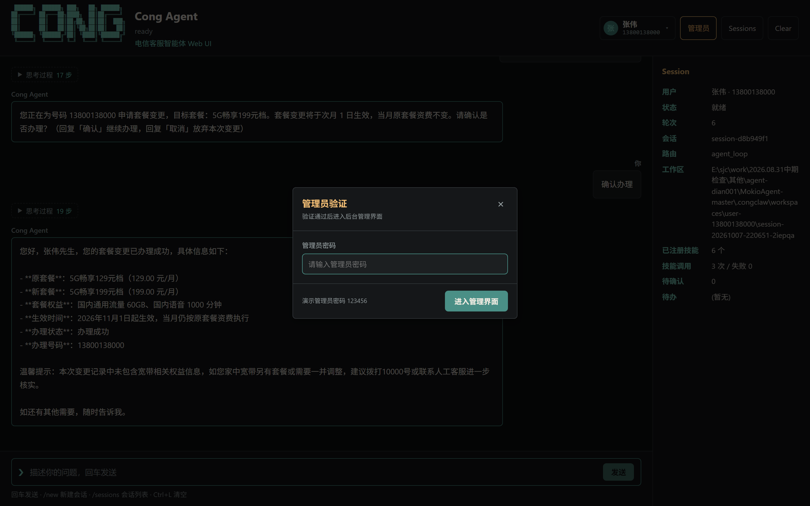

**数据库管理页签**：左侧列出全部数据表（含行数），右侧表格支持搜索、分页、`新增一行`、逐行 `编辑` / `删除`；主键列带 `PK` 标记。

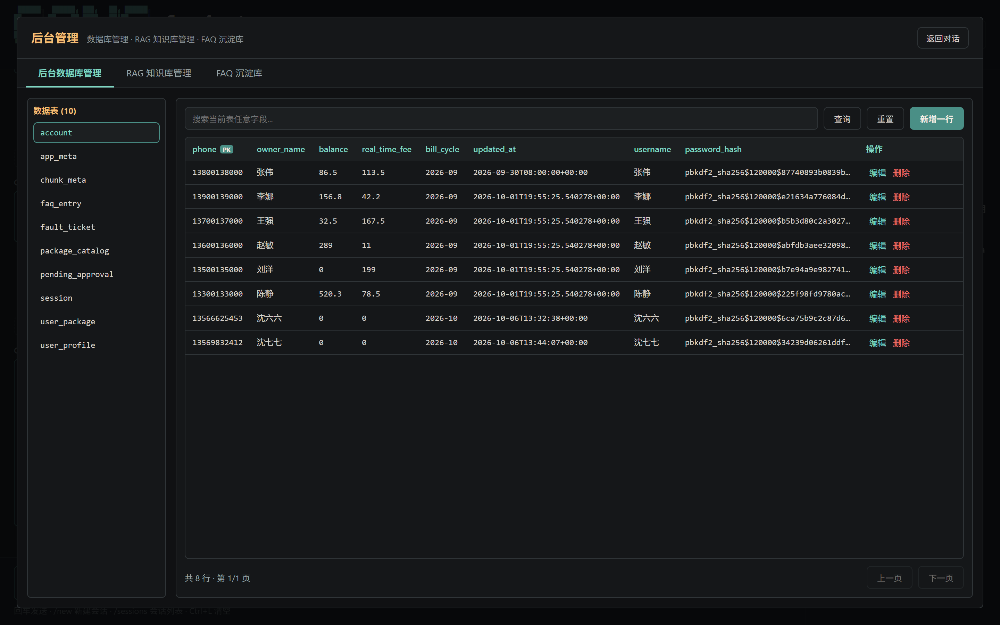

点击任意行的「编辑」弹出字段编辑框，改完保存即刻写库：

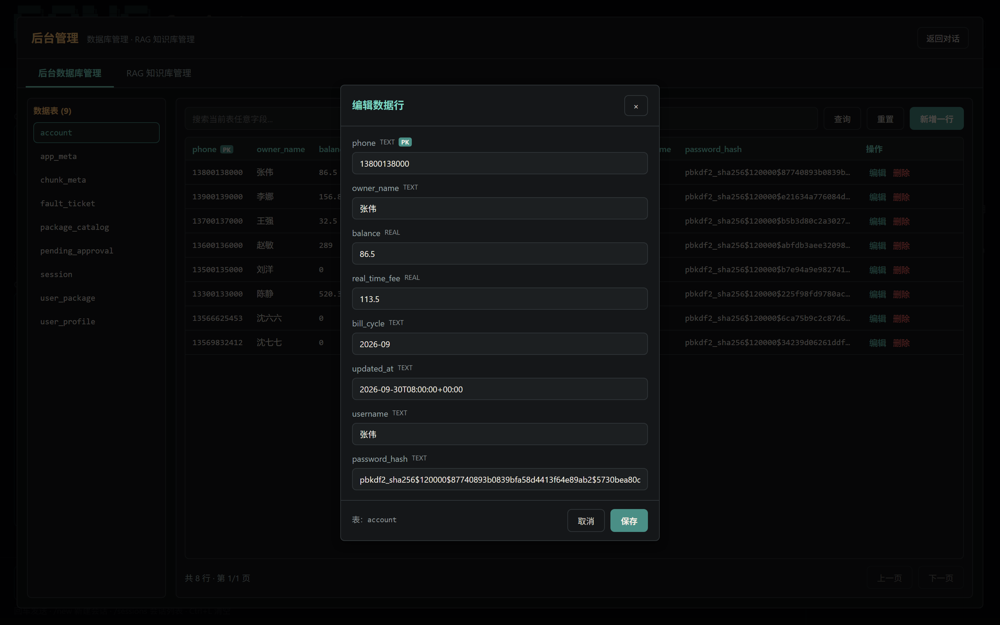

**RAG 知识库管理页签**：顶部为规模统计卡片（SQLite 分片数 / Milvus 向量数 / 知识来源数），中部为入库操作（全量入库、上传文档），下部为知识来源列表。

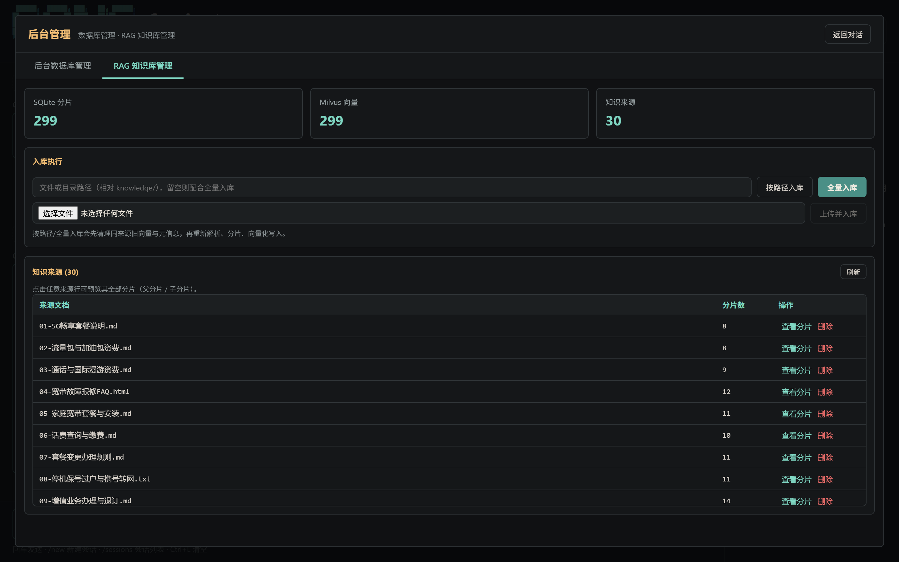

点击某个来源即可预览其**父分片 / 子分片**明细：

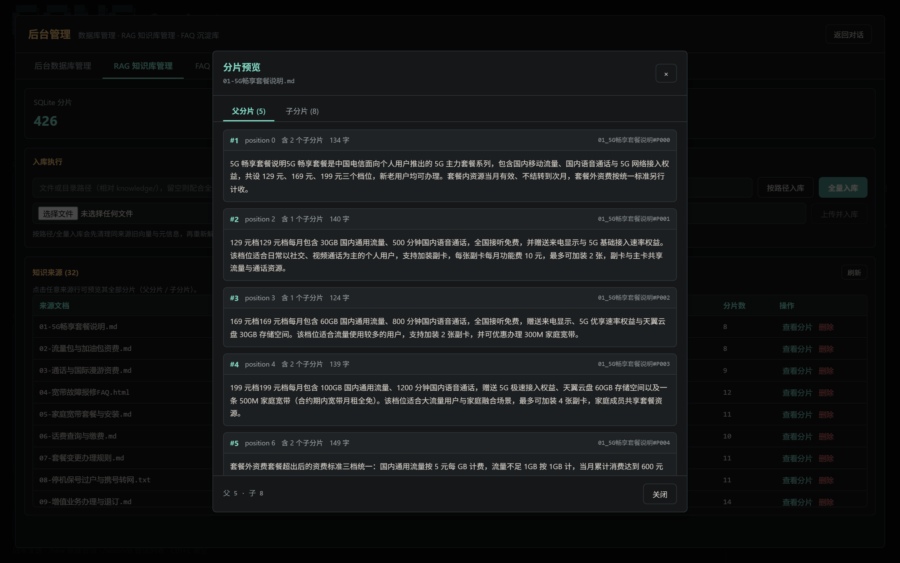

**FAQ 沉淀库页签**（阶段 7 新增）：顶部为统计卡片（沉淀条目 / 待审核草稿 / 已通过已发布 / 覆盖分类），下方为筛选条（状态、分类、关键词）与条目表格（编号、标准问句、分类、合并次数、置信度、状态、操作）。

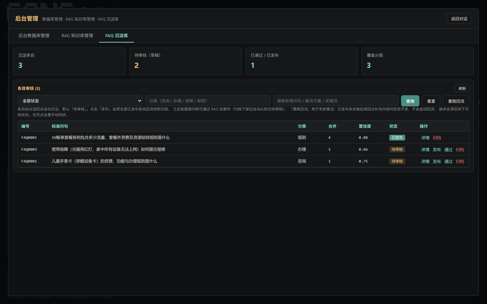

点击某行的「详情」可查看完整条目——标准问句、同义问法、解决方案全文、前置条件、关联技能与溯源信息（来源路由 / 来源会话与轮次 / 关键词 / 引用来源数）：

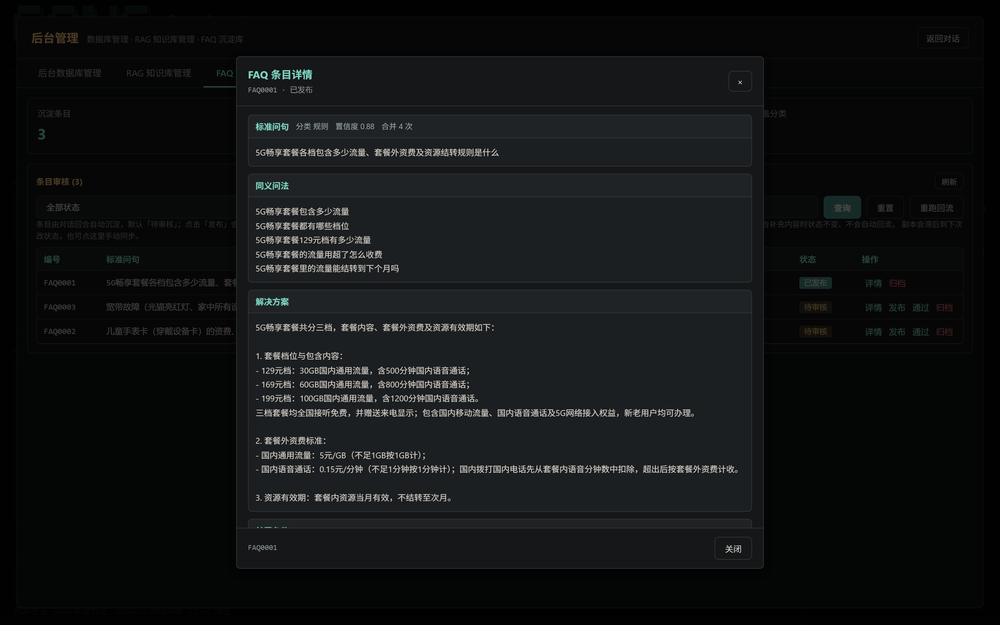

行内操作与状态流转：

| 操作 | 说明 |
|------|------|
| 详情 | 查看完整条目与溯源 |
| 通过 | `draft` → `approved`（人工确认内容可用） |
| 发布 | 任意非 `published` → `published`，**触发知识库回流** |
| 归档 | `published` → `archived` 下架，**同时触发回流**把该条从知识库移除 |
| 重跑回流 | 手动把全部已发布条目重新渲染入库（回流失败重试 / 已发布条目被合并补充后的同步） |

按状态筛选「已发布」即可只看到已回流知识库的条目：

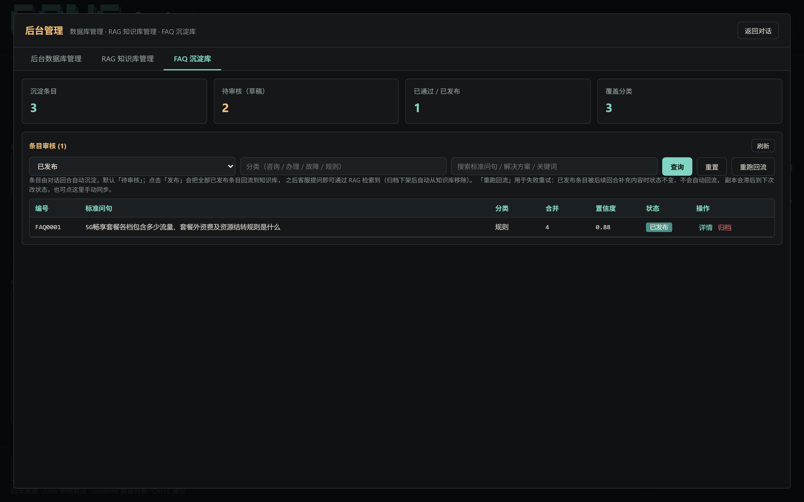

> 演示常用：把 `user_package` 表中 `13800138000` 的 `package_id` 改回 `P129`、`package_name` 改回 `5G畅享129元档`，即可快速还原演示初始状态。

---

## 四、知识库入库（RAG 检索依赖）

RAG 快查依赖「文档 → 父子分片 → 向量化入库」的结果，**首次演示前必须执行一次**。

> ⚠️ **Milvus Lite 是单进程独占锁**：`data/milvus_lite.db` 同一时刻只能被一个进程打开。
> 若后端服务（`uvicorn`）或 `serve_milvus_lite.py` 正在运行，先 **`Ctrl + C` 停掉**再执行入库/`--stats`，
> 否则会报 `DataDirLockedError: another process holds the lock`。入库完成后再启动服务。
> （也可以服务运行期间改用 API 入库，见第九节。）

```bash
# 全量入库 knowledge/ 目录（默认行为）
uv run python -m congclaw.rag

# 查看知识库规模（SQLite 分片数 + Milvus 向量数 + 来源文件）
uv run python -m congclaw.rag --stats

# 入库指定文件（覆盖式：同来源先删后写，幂等）
uv run python -m congclaw.rag knowledge/01-5G畅享套餐说明.md

# 入库指定目录
uv run python -m congclaw.rag knowledge
```

`--stats` 示例输出（数量取决于当前已入库文档）：

```json
{
  "chunk_count": 299,
  "milvus_count": 299,
  "sources": ["01-5G畅享套餐说明.md", "02-流量包与加油包资费.md", "..."]
}
```

支持的文档格式：`.md` / `.html` / `.txt`（见 `SUPPORTED_SUFFIXES`）。

### 增量同步（只处理变化的文档）

全量重灌会重新向量化整个 `knowledge/`；文档较多时改用增量同步脚本——它用清单文件记录每份文档的 sha256 指纹，只处理真正变化的文件（新增/修改走幂等覆盖入库，删除则同步清理向量与分片元信息）：

```bash
uv run python scripts/watch_knowledge.py             # 检查一次并同步（默认）
uv run python scripts/watch_knowledge.py --status    # 只显示变更、不入库（干跑）
uv run python scripts/watch_knowledge.py --baseline  # 首次接入已有知识库：只记录指纹，不重复入库
uv run python scripts/watch_knowledge.py --watch     # 常驻监听，按间隔轮询自动同步
```

清单默认落在 `data/knowledge_manifest.json`。同样受 Milvus 单进程独占锁限制，执行前请先停服务（或用 `--status` 干跑）。

> `knowledge/FAQ沉淀库.md` 是**自动生成**的 FAQ 回流文档（见 6.6），不要手工编辑——每次 FAQ 发布 / 归档都会整份重写它。

---

## 五、启动服务

```bash
uv run uvicorn congclaw.api.main:app --host 127.0.0.1 --port 8000
```

启动日志会依次出现：

1. SQLite 建库/连接 `data/telecom_cs.db`（幂等）
2. Milvus Lite 向量库连接
3. Skill 注册中心扫描（内置 6 个 + 外部 `data/skills` 目录）+ 开启目录监听
4. 后台预热 BGE-M3 / bge-reranker（约 10~20 秒，`RAG_PREWARM=0` 可关闭）

服务就绪后，**另开一个终端窗口**执行后续演示命令。

### 健康检查

```bash
curl http://127.0.0.1:8000/health
```

返回示例：

```json
{
  "status": "ok",
  "db_path": "E:\\...\\data\\telecom_cs.db",
  "model_warmup": "BGE-M3 / bge-reranker 启动后后台预加载（RAG_PREWARM=0 关闭）"
}
```

> 交互式接口文档：浏览器打开 <http://127.0.0.1:8000/docs>。

### 启动 Web UI

后端服务保持运行，**另开一个终端**启动前端（前端目录 `ui/`）：

```bash
cd ui
npm install      # 首次执行，安装前端依赖
npm run dev      # 启动 Vite 开发服务器
```

终端会打印访问地址（默认 `http://localhost:5173/`；端口被占用时 Vite 会自动递增为 `5174`、`5175` 等，以终端实际输出为准）。浏览器打开该地址即可进入对话界面。

前端通过 Vite 代理把 `/api` 转发到后端 `http://127.0.0.1:8000`（见 `ui/vite.config.js`），因此**必须先启动后端**。

首次进入界面（默认以种子用户 `13800138000` 张伟登录）：

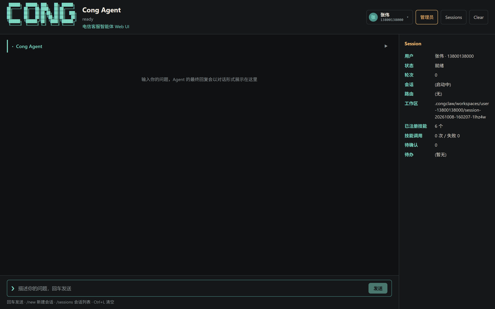

界面分区：

| 区域 | 内容 |
|------|------|
| 顶部栏 | CONG Logo、连接状态（ready / running）、账号切换、管理员、`Sessions`、`Clear` |
| 中间 | 对话事件流（用户消息、「思考过程 N 步」可展开、最终答复） |
| 输入区 | 问题输入框 + 发送按钮（回车发送） |
| 右侧 | Session 侧边栏：用户 / 状态 / 轮次 / 会话 / 路由 / 工作区 / 已注册技能 / 技能调用 / 待确认 / 待办 |

**账号体系**：点击顶部账号按钮可切换已注册用户；下拉里另有「登录其他账号」「注册新账号」。

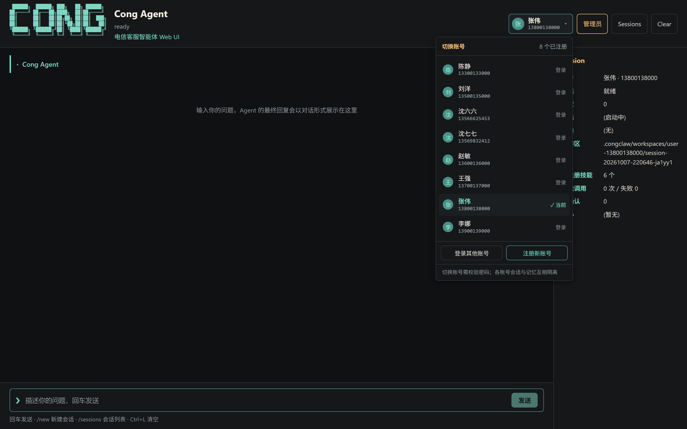

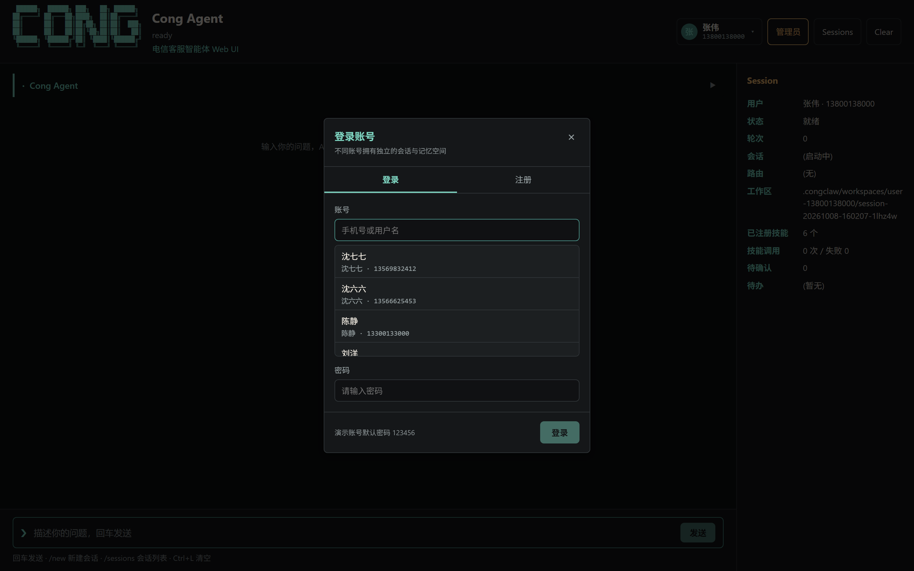

演示账号默认密码为 `123456`。登录 / 注册成功后界面会自动带上该号码的会话与记忆：

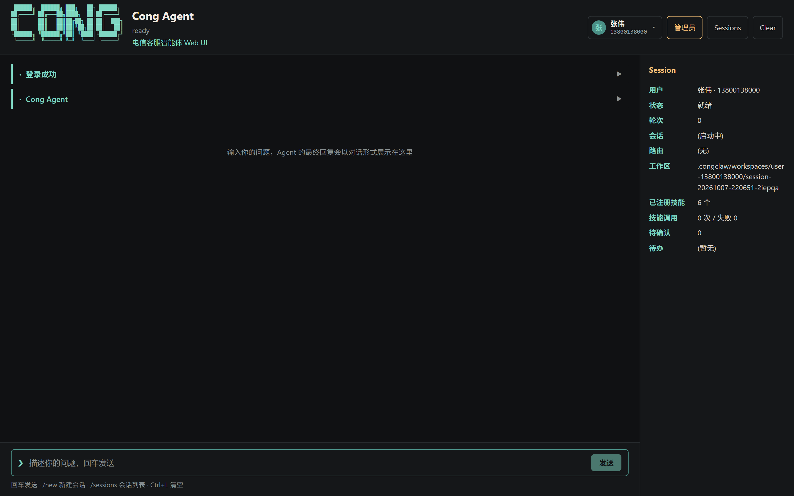

**常用快捷键与命令**：`Ctrl + L` 清空事件面板、`Ctrl + S` 打开会话列表、`Esc` 逐层关闭弹窗；输入框内 `/new` 新建会话、`/sessions` 会话列表、`/clear` 清空。

---

## 六、四类业务手动演示（Web UI）

演示入口：浏览器打开 Web UI（见第五节）。演示号码为种子用户 **13800138000**（张伟，5G 畅享 129 元档），首次进入默认即为该账号。

每次提问后界面会实时流式输出：用户消息 →「思考过程 N 步」（可点击展开事件卡）→ 最终答复；右侧 Session 侧边栏同步刷新 `路由`、`轮次`、`技能调用`、`待确认` 等状态。

### 6.1 余额查询（Agent 单工具）

在输入框输入（回车发送）：

```
帮我查一下话费余额
```

**预期行为**：

- 意图分流 → `agent_service`（侧边栏 `路由` 变为 `agent_loop`）
- 思考节点决定调用 `query_balance`，自动使用会话绑定号码，无需重复提供
- 返回余额 86.50 元、2026 年 9 月实时话费 113.50 元
- 反思校验通过，输出自然语言答案

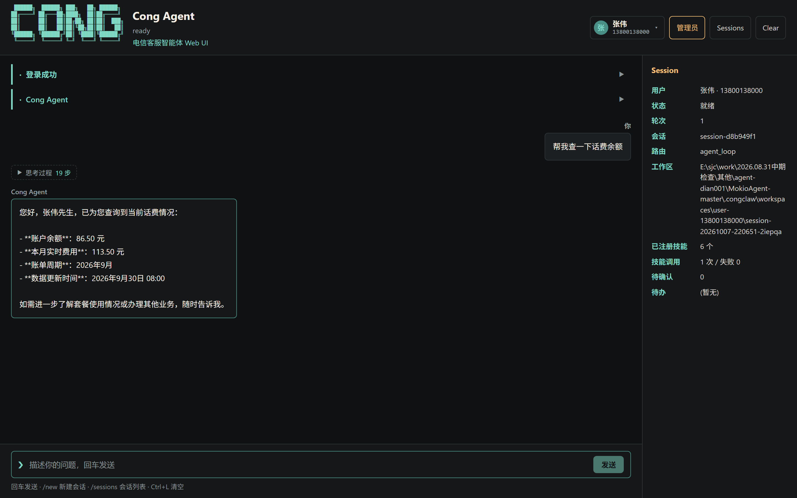

点击答复上方的「思考过程 N 步」可展开完整事件链，核对意图路由与工具调用：

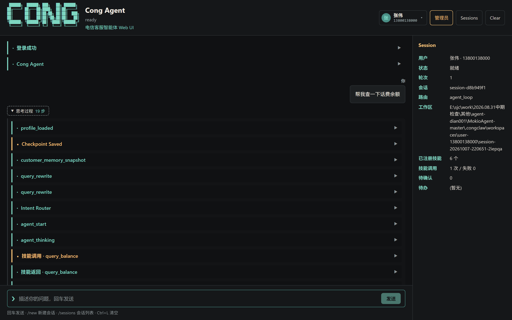

### 6.2 套餐咨询（RAG 检索）

输入：

```
5G畅享套餐包含多少流量？
```

**预期行为**：

- 意图分流 → `rag_query`（侧边栏 `路由` 变为 `rag_answer`）
- BM25 + 稠密向量**并行召回** → RRF 融合排序 → Cross-Encoder 精排
- 父分片回溯，生成带**来源片段编号**的答案（正文里的 `[1]`、`[2]` 对应答案下方的来源列表）
- 底部列出引用来源（如 `来源：[1] 5G畅享套餐说明.md`）

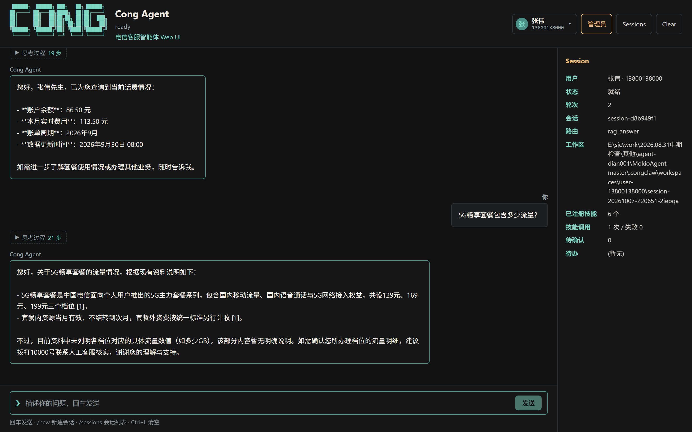

### 6.3 故障报修（Agent 多工具并行）

**第一轮**（信息不全，系统先追问）：

```
我家宽带突然不能上网了，帮我报修
```

系统发现缺少上门地址，先追问：

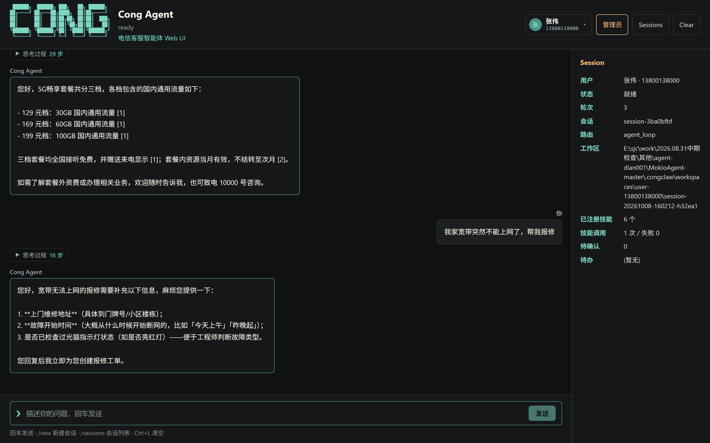

**第二轮**（补全信息后建单）：

```
地址是北京市海淀区中关村大街1号院3号楼502室，从今天早上8点开始光猫亮红灯，家里所有设备都连不上网。
```

**预期行为**：

- 意图分流 → `agent_service`
- `report_fault` 建单 与 `query_fault_status` 查历史进度 **并行执行**
- 返回工单号（如 `FT202610072207399ae0`）与当前受理状态

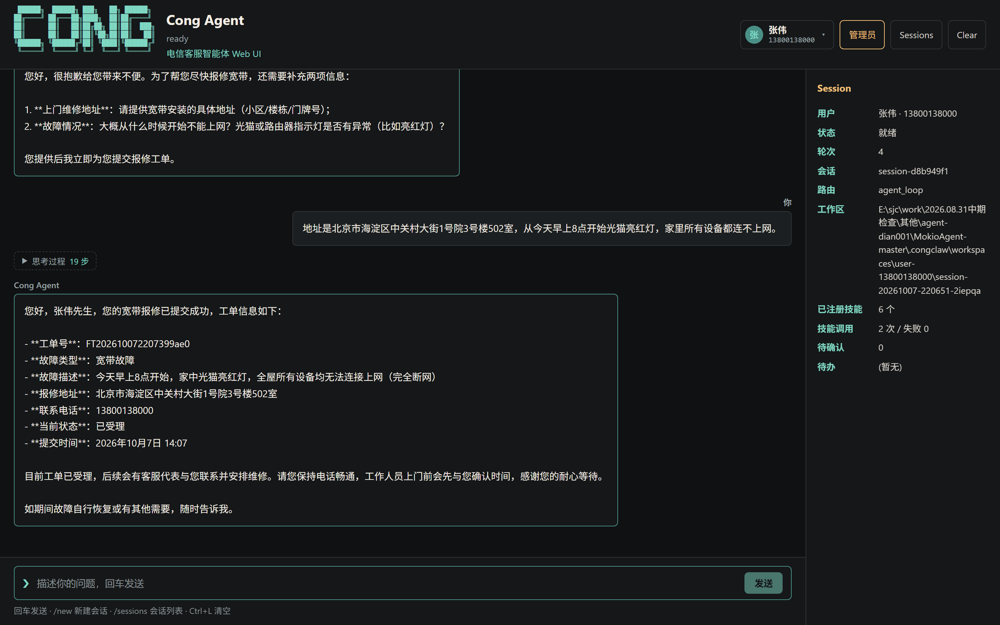

### 6.4 套餐变更（含人工确认）

**第一轮**（提出诉求）：

```
帮我把套餐改成199元的5G畅享套餐
```

由于 `change_package` 是**高危写操作**，系统不会立即执行：先落 `pending_approval` 待确认单，并回复确认话术（侧边栏 `待确认` 变为 1）：

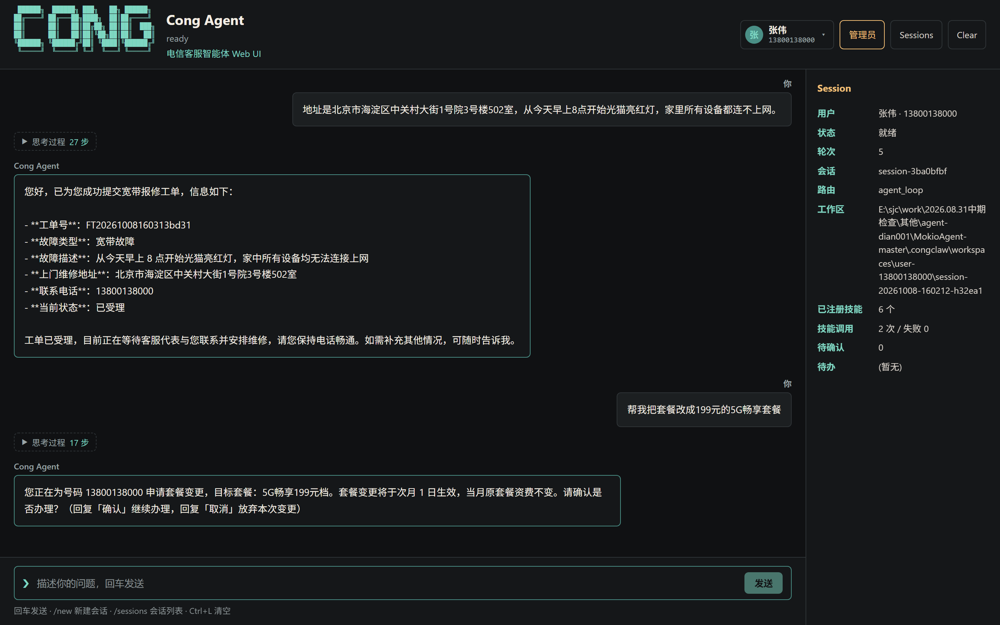

**第二轮**（回复确认）：

```
确认办理
```

确认后执行变更，返回新套餐与生效日期（原套餐 → 新套餐，生效日次月 1 日）：

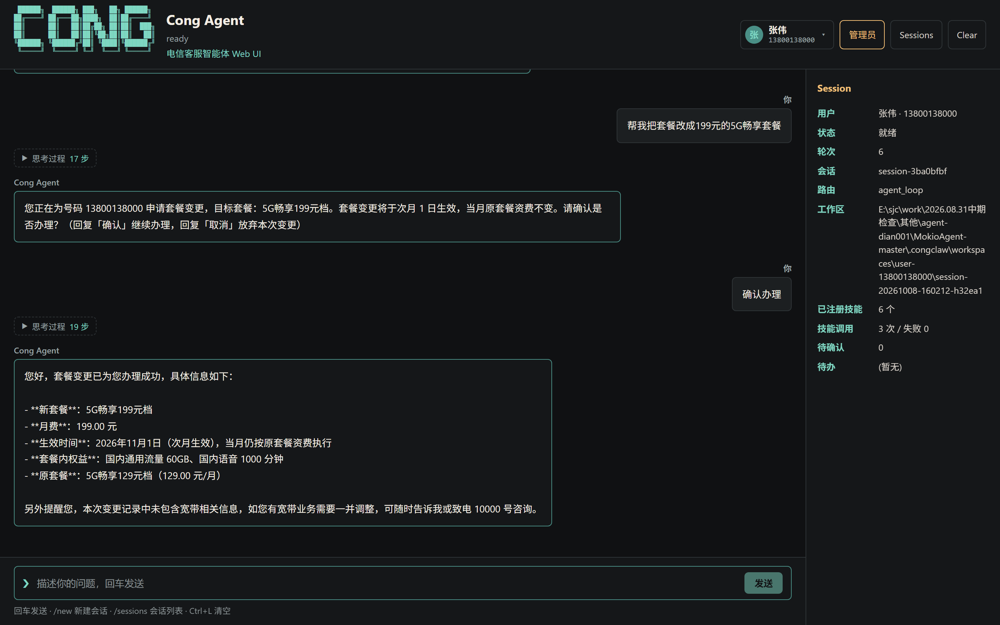

如回复 `取消`，则本次变更作废，状态回滚。

> **说明**：业务写操作的确认是**对话式**的（回复「确认办理」继续），界面不会弹模态框。模态审批框只在 Agent 调用 Bash 高危命令（如 `pip install` / `uv sync` / `uvicorn`）时出现。

> **审批模式快捷切换**（CLI 备选）：
> ```bash
> uv run congclaw --approval-mode auto tui   # 自动批准（演示/评测用，跳过人工确认）
> uv run congclaw --approval-mode deny tui   # 一律拒绝写操作
> ```

变更后可在后台管理界面（见 3.7）或命令行验证：

```bash
uv run python -c "import sqlite3; c=sqlite3.connect('data/telecom_cs.db'); [print(r) for r in c.execute('select phone, package_id, package_name, effective_date from user_package')]"
```

> ⚠️ **重复演示前请重置**：变更会真实改写 `user_package` 表，第二次演示会返回「当前已是该套餐，无需重复变更」。可在后台管理界面把 `13800138000` 改回 `P129 / 5G畅享129元档`（见 3.7），或执行 `uv run python -m congclaw.db` 后手动改回种子值。

### 6.5 备选：CLI / TUI 演示

同一套业务能力也可通过命令行验证（需后端服务已启动）：

```bash
uv run congclaw "帮我查一下话费余额"          # 单轮问答
uv run congclaw "5G畅享套餐包含多少流量？"
uv run congclaw tui                            # 多轮对话（TUI 界面）
```

### 6.6 常见问答沉淀与回流（阶段 7）

每轮客服回合结束后，主图会先做一次**规则门控**判断「本轮是否值得沉淀」，通过才进入 **FAQ 沉淀子图**：

```
rule_gate（规则门控）→ match_existing（判重召回已有条目）→ extract（LLM 抽取结构化条目）→ persist（落库）
```

**门控条件**（同时满足才沉淀）：

| 条件 | 说明 |
|------|------|
| 路由 | 仅 `rag_answer` / `agent_loop`（追问、兜底没有可沉淀结论） |
| 实质结果 | RAG 需有检索来源；Agent 需工具调用成功且反思通过 |
| 排除 | 无兜底、无未决人工确认 |
| 问句 | ≥ 6 字，且不含手机号 / 身份证 / 银行卡等隐私信息 |
| 增量 | 与已有条目比对后判定 `create`（新建）/ `merge`（并入已有条目）/ `skip`（跳过） |

**不满足门控的回合根本不进子图、不产生任何模型调用**，所以绝大多数对话不会因沉淀能力而变慢。

在 Web UI 展开「思考过程」，即可看到本轮的沉淀事件链：

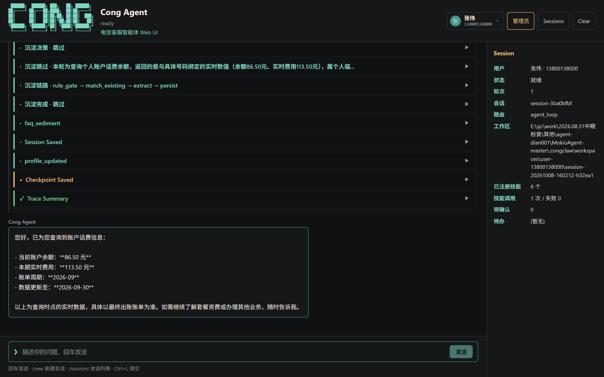

上图是一次余额查询：模型判定为 `skip`（个人账户实时数值不具备通用性），链路照样完整走完四个节点，只是不落库。

再看套餐咨询这类 `rag_answer` 且有来源的回合，就会真正落库，**沉淀条目 +1、状态为「待审核（draft）」**。审核与回流演示步骤：

```
1. 对话两三轮（如「5G畅享套餐包含多少流量？」「宽带故障如何报修？」）
2. 打开 后台管理 → FAQ 沉淀库，看到新增的 draft 条目
3. 点「详情」核对内容与溯源 → 点「通过」→ 点「发布」
4. 发布时自动把全部已发布条目回流成 knowledge/FAQ沉淀库.md 并重新入库
5. 之后再问同类问题，RAG 会命中该文件（答案来源列表中出现 FAQ沉淀库.md）
```

状态流转：`draft`（默认待审）→ `approved`（人工通过）→ `published`（发布并回流）；`archived` 为下架，会把该条从知识库移除。完整界面见 3.7。

API / 命令行等价方式：

```bash
# 沉淀库规模（状态分布、分类分布、高频条目 TOP5）
curl http://127.0.0.1:8000/api/v1/faq/stats

# 分页查询（可按 status / category / q 筛选）
curl "http://127.0.0.1:8000/api/v1/faq?status=draft&limit=20"

# 单条详情（含同义问法、解决方案、溯源）
curl http://127.0.0.1:8000/api/v1/faq/FAQ0001

# 人工审核流转：通过 / 发布 / 归档
curl -X PUT http://127.0.0.1:8000/api/v1/faq/FAQ0001/status -H "Content-Type: application/json" -d "{\"status\": \"published\"}"

# 手动重跑回流（失败重试 / 已发布条目被合并补充后的同步）
curl -X POST http://127.0.0.1:8000/api/v1/faq/reflow
```

关闭沉淀能力：`.env` 设 `CONG_FAQ_SEDIMENT=0` 后重启服务。

---

## 七、对话管控演示（Web UI）

以下均在 Web UI 输入框直接输入（CLI 等价写法为 `uv run congclaw "..."`）。

### 7.1 模糊意图追问（最多 5 轮）

```
我想换个更划算的
```

系统会追问：`"您是指手机套餐、流量包，还是宽带套餐呢？"`

连续追问到第 5 轮仍无法明确意图时，**自动兜底**，礼貌说明服务边界。

### 7.2 无关请求直接兜底

```
帮我写首诗
```

系统直接回复兜底话术，说明本智能体仅支持电信客服业务，并引导回四类业务场景。

### 7.3 指代消解（多轮）

同一会话内连续提问，第二轮用指代词，系统会自动重写为完整问句：

| 轮次 | 输入 | 系统行为 |
|------|------|---------|
| 第 1 轮 | `5G畅享199元档套餐怎么样` | RAG 检索，返回套餐详情 |
| 第 2 轮 | `那这个多少钱` | **指代消解**：重写为「5G畅享199元档套餐多少钱」，返回月费 199 元 |
| 第 3 轮 | `帮我办这个` | 路由到办理 Agent，自动带出套餐名，推送确认话术 |

展开「思考过程」中的 `query_rewrite` 事件即可看到重写前后的问句对照。

---

## 八、Skill 热插拔演示

服务**不需要重启**。运行中新增 Skill，下一轮对话即可调用。

### 方式一：API 热注册

将以下内容保存为 `demo_skill.json`：

```json
{
  "name": "demo_hello",
  "content": "from congclaw.skills.base import Skill, SkillContext\n\nclass DemoHelloSkill(Skill):\n    name = \"demo_hello\"\n    description = \"打个招呼，返回当前时间戳\"\n    access = \"read\"\n    async def run(self, context: SkillContext, **kwargs):\n        import time\n        return {\"ok\": True, \"message\": f\"Hello from {context.phone} at {int(time.time())}\"}\n\nSKILL = DemoHelloSkill()\n"
}
```

执行注册：

```bash
curl -X POST http://127.0.0.1:8000/api/v1/skills -H "Content-Type: application/json" -d @demo_skill.json
```

验证已加载：

```bash
curl http://127.0.0.1:8000/api/v1/skills
```

在 Web UI 输入框中输入 `"用 demo_hello 打个招呼"`，Agent 思考节点会识别并调用该 Skill（侧边栏 `已注册技能` 数量同步 +1）。

### 方式二：文件写入（watcher 自动发现）

将上述 Python 源码保存为 `data/skills/demo_hello.py`，watcher 线程会在轮询周期（默认 2 秒）内自动加载。

### 热卸载

```bash
curl -X DELETE http://127.0.0.1:8000/api/v1/skills/demo_hello
```

---

## 九、知识库管理（API）

> Web UI 的**后台管理 → RAG 知识库管理**页签同样提供规模统计、全量入库、上传文档、来源列表与分片预览（见 3.7）；本节为其 HTTP / 命令行等价形式。另有走服务进程的 API 入库入口，**不受 Milvus 单进程锁限制**，可在服务运行期间直接使用。

### 9.1 查看知识库规模

```bash
curl http://127.0.0.1:8000/api/v1/knowledge/stats
```

返回示例：

```json
{
  "chunk_count": 299,
  "milvus_count": 299,
  "sources": ["01-5G畅享套餐说明.md", "..."]
}
```

### 9.2 全量重新入库

```bash
curl -X POST http://127.0.0.1:8000/api/v1/knowledge/ingest -H "Content-Type: application/json" -d "{\"all\": true}"
```

### 9.3 上传单个文档入库

```bash
curl -X POST http://127.0.0.1:8000/api/v1/knowledge/ingest/upload -F "file=@knowledge/01-5G畅享套餐说明.md"
```

上传的文件会先保存到 `knowledge/uploads/`，再解析入库。

---

## 十、历史会话管理

每轮对话都会持久化到 SQLite 的 `session` 表，可在 **Web UI** 中查看切换，也可通过 API 查询。

### 10.1 Web UI 会话面板

点击顶部栏 **Sessions** 按钮（或按 `Ctrl + S`、输入 `/sessions`）打开会话列表：

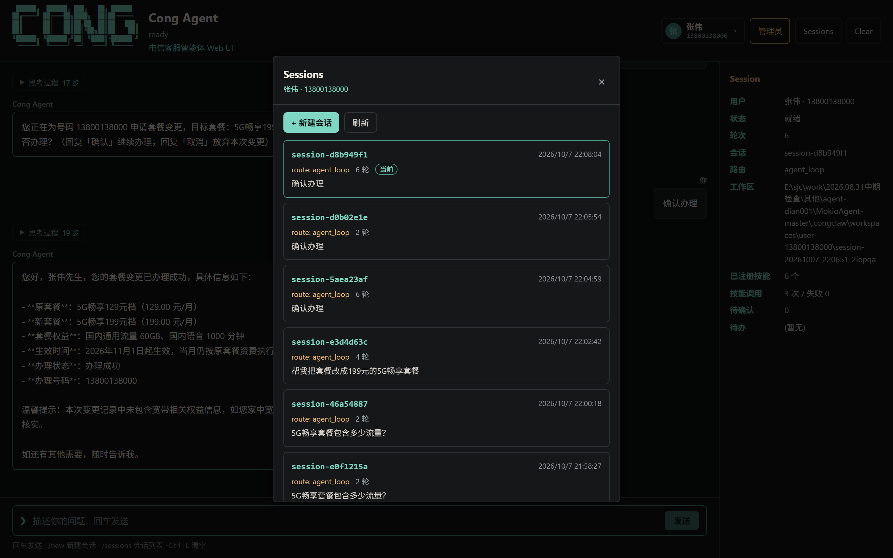

每条记录包含：`session_id` 前 16 位、更新时间、`route`（最近一次路由）、轮次（N 轮）、`<当前>` 标记与最近一次问题。面板顶部 **+ 新建会话** 开启新会话，**刷新** 重新拉取列表。

> 会话与记忆**按用户隔离**：切换账号后只会看到该号码自己的会话。

### 10.2 API 查询

```bash
# 列出全部历史会话（按更新时间倒序）
curl http://127.0.0.1:8000/api/v1/sessions

# 按 session_id 查询单个会话详情（含最近对话轮次）
curl http://127.0.0.1:8000/api/v1/sessions/{session_id}
```

### 10.3 TUI 内操作（备选）

| 操作 | 快捷方式 |
|------|---------|
| 打开会话列表 | `Ctrl + S` 或输入 `/sessions` |
| 新建会话 | 输入 `/new` |
| 清空当前事件面板 | `Ctrl + L` |
| 退出 | `Ctrl + Q`（运行中先 `Ctrl + C` 取消） |

---

## 十一、自动化评测

一键运行 30 条标注评测集（四类业务 + 模糊 + 无关）：

```bash
curl -X POST http://127.0.0.1:8000/api/v1/eval/run -H "Content-Type: application/json" -d "{\"use_llm_judge\": true}"
```

只跑指定样本、或关闭 LLM-Judge（快很多）：

```bash
curl -X POST http://127.0.0.1:8000/api/v1/eval/run -H "Content-Type: application/json" -d "{\"use_llm_judge\": false, \"sample_ids\": [\"E01\", \"E19\"]}"
```

> 评测只有 HTTP 入口，**没有** `congclaw eval` 之类的 CLI 子命令；需先启动服务（见第一章）。
> 评测时写操作走 `approval_mode=auto` 自动批准，不会卡在人工确认上。

返回报告摘要，例如：

```json
{
  "report_id": "eval-20261002-153012",
  "total": 30,
  "passed": 23,
  "pass_rate": 76.7,
  "average_scores": {
    "answer_quality": 3.73,
    "reasoning": 4.07,
    "compliance": 4.77,
    "average": 4.19
  },
  "trace_summary": {
    "total": 30,
    "applicable": 24,
    "passed": 24,
    "failed": 0
  },
  "report_path": "eval/reports/eval-20261002-153012.md"
}
```

### 三套判定口径

报告里有三条互不影响的判定线，注意 `pass_rate` 是**百分比数值**（如 `76.7`），不是 0~1 的小数：

| 口径 | 内容 | 是否计入 pass_rate |
|------|------|------|
| 规则校验 | 分流正确性、工具参数合法性、兜底触发、追问 ≤5 轮 | **是** |
| 链路校验 | trace 结构断言（RAG / Agent 子图链路） | 否，独立成节 |
| 链路指标 | 各环节数值观测值（召回条数、门控裕度、成功率、耗时等） | 否，独立成节 |
| LLM-Judge | 答案质量 / 推理逻辑 / 话术合规，各 1~5 分 | 否，独立成节 |

规则校验只看样本**终态**，链路校验看**中途**，用来定位「断在哪一环」。链路断言失败不拉低 `pass_rate`，只在「链路校验」小节列出失败断言、失败样本与断言失败分布。

逐条断言：

| 断言 | 校验内容 |
|------|---------|
| `rag_trigger` / `agent_trigger` | 路由与子图触发一致：该走 RAG / Agent 才进子图，不该走的不得触发 |
| `rag_lifecycle` | `rag_start` → `rag_finished` 顺序闭环，子图异常中断单独报出 |
| `rag_dual_recall` / `rag_recall_pairing` | 首轮 BM25 + dense 双路并行召回，两路召回次数成对且通道齐备 |
| `rag_stage_alignment` | 每轮环节事件数固定为 召回×2 : 融合×1 : 精排×1 : 门控×1 |
| `rag_stage_order` | 同轮环节不可逆（`rag_rewrite` 开启新一轮，回到召回相位） |
| `rag_gate_decision` | 证据门决策 ∈ `{parent_lookup, rewrite, fallback}` |
| `rag_rewrite_rerun` | 重写至多 1 次，且重写后必须重新召回并再次门控 |
| `rag_terminal_consistency` | 末次门控与终态一致、答案与兜底互斥、生成答案前必有父分片回溯 |
| `agent_call_pairing` | `skill_call` ↔ `skill_result` 按 `call_id` 一一配对，无孤儿结果 |
| `agent_terminal` | 终态为答复或兜底，且两者互斥 |
| `agent_confirm_isolation` | 写操作弹出确认卡片后，同一回合不得执行该 Skill |
| `agent_reflect_consistency` | 反思决策自洽：有失败工具不得放行、`retry` 后必须重新调用、`fallback` 后必须走兜底 |

既不走 RAG 也不走 Agent 的轨迹（如追问）标记为「不适用」，不计入链路失败。

### 链路指标（观测值）

链路校验回答「对不对」，链路指标回答「好不好、多快」。指标只给观测值、**不设阈值**，每项输出均值 / 最小 / 最大 / 样本数：

| 分组 | 指标 |
|------|------|
| 全局 | 意图置信度、意图判定耗时、端到端耗时 |
| RAG | 首轮 BM25 / dense 召回条数、首轮空召回路数、RRF 融合保留率、精排头部相关概率、证据门裕度（头部概率 − 阈值，越大越稳）、门控命中条数、重写有效性、父分片回填数、每父分片命中子片段数、答案引用条数、RAG 子图耗时 |
| Agent | 工具执行次数、工具成功率、每轮思考调用数、首次反思放行、反思重试次数、反思校验项通过率、Agent 子图耗时 |

几点读数约定：

- **样本数（n）是该指标真正适用的样本数**，链路里没走到这一步的样本不计入，所以不同指标的 n 可以不同（例如只有 1 条样本真的调了工具，`工具执行次数` 的 n 就是 1）。
- 指标**缺席即不适用**，不会记 0（如非 RAG 样本不输出 `rag_*`）。
- **耗时类指标依赖落盘 trace**（`events.jsonl` 每条记录带 `elapsed_ms`）；读到的是累计耗时，报告里展示的是相邻环节的差值。内存事件流（单测、评测中间态）没有时间戳，此时不产出耗时指标。

### 查看报告列表

```bash
curl http://127.0.0.1:8000/api/v1/eval/reports
```

### 查看单条报告详情

```bash
# Markdown 格式（默认）
curl http://127.0.0.1:8000/api/v1/eval/reports/eval-20261002-153012

# JSON 格式
curl "http://127.0.0.1:8000/api/v1/eval/reports/eval-20261002-153012?format=json"
```

报告保存路径：`eval/reports/eval-{时间戳}.md`（同目录另有 `.json`）。报告内容依次为：概览、LLM-Judge 分项平均分、规则校验结果表、链路校验、链路指标、失败用例归因（含原始轨迹回链）、LLM-Judge 详表；JSON 版额外带 `trace_summary`、`trace_assertion_failures`、`trace_metrics`，以及每条样本的 `trace` 与 `metrics` 明细。

---

## 十二、总验收脚本（一键跑全部 Checklist）

### 一条龙：全量测试 + 出评测报告

> 前置：服务已在运行（第五节）。评测走 HTTP 接口，写操作自动批准，不会卡在人工确认。

```bash
uv run pytest -q ; uv run python scripts/acceptance_check.py
```

| 阶段 | 内容 | 耗时（实测参考） |
|------|------|------|
| ① 全量单测 | 全部单测/集成测试，不依赖服务与模型 | 约 3~4 分钟 |
| ② 真链路验收 | 下面 7 项，逐项打 SSE 接口实测 | 约 2 分钟 |
| ③ 全量评测 | 第 7 项内部触发 30 条标注集 + LLM-Judge，生成报告 | 约 6 分钟 |

跑完的产物：`eval/reports/eval-{时间戳}.md`（同目录另有 `.json`），指标含义与查看方式见第十一节。
验收结果在末行汇总，形如 `结果: 8/8 项通过`（其中「追问/无关兜底」拆成 2a/2b 单独计数），并逐项打印 ✅/❌。

> ⚠️ 报告是**整轮评测跑完才一次性写盘**的，跑的过程中 `eval/reports/` 不会出现新文件；中途 `Ctrl + C` 则完全没有产物（也没有部分结果）。

### 分步执行

针对**运行中的服务**逐项实测（对应 PRD 第 8 节）：

```bash
uv run python scripts/acceptance_check.py              # 全部 7 项
uv run python scripts/acceptance_check.py --skip-eval  # 跳过耗时的一键评测
uv run python scripts/acceptance_check.py --keep       # 保留本次验收工作区，便于事后翻查
```

覆盖项：① 四类业务端到端 ② 追问/无关兜底 ③ RAG 来源与父子回溯 ④ Agent 思考→调用→反思轨迹
⑤ Skill 热插拔 ⑥ 指代消解 ⑦ 评测流水线出报告。依赖 `httpx`（已随项目安装）。

### 中间产物的清理策略

测试会在两处产生中间文件，都有自动清理：

| 产物 | 位置 | 清理方式 |
|------|------|----------|
| 验收工作区 | 项目根 `acc-*` | 每次验收**跑完自动删除**本次新建的目录（失败或 Ctrl+C 也会在 `finally` 里清）；加 `--keep` 保留 |
| 评测工作区 | 系统临时目录 `%TEMP%\cong-eval-*` | 每次评测结束时**只保留最近 3 次**（含本次），更早的连同临时空间一并回收 |

评测目录不"跑完即删"是因为报告里的「轨迹回链」指向其中的 `events.jsonl`——留着最近几次才能回看失败样本的原始事件流。保留次数由 `congclaw/eval/runner.py` 的 `WORKSPACE_KEEP` 控制（默认 3）。

> 历史遗留的 `acc-*` 目录不会自动消失（旧版本不清理），如需一次性清空：
> `Remove-Item -Recurse -Force .\acc-*`（PowerShell）；`.gitignore` 已加入 `acc-*/`，这些目录不会进仓库。

---

## 十三、查看会话轨迹（Trace）

每次对话的完整事件链自动落盘，路径示例：

```
.congclaw/workspaces/{workspace-时间戳-随机}/
├── SESSION_SUMMARY.md          # 人读的会话摘要
└── .congclaw/traces/{trace_id}/
    ├── events.jsonl            # 逐条事件（意图判定/RAG召回/工具调用/反思校验/沉淀判定）
    └── summary.json            # 轨迹摘要
```

常用查看方式：

```bash
# 列出所有 trace 目录
Get-ChildItem .congclaw\workspaces -Recurse -Directory -Filter "trace-*" | Select-Object -ExpandProperty FullName

# 查看最新一条轨迹的事件流（前 20 行）
Get-ChildItem .congclaw\workspaces\*\*\traces\*\events.jsonl | Sort-Object LastWriteTime -Descending | Select-Object -First 1 | Get-Content | Select-Object -First 20
```

Trace 可用于：

- 人工复盘某次对话的决策链路
- 评测失败用例回链原始轨迹定位根因；评测的「链路校验」正是基于这份事件流做结构断言
- 观察 RAG 子图的并行召回 → 融合 → 精排全过程
- 查看常见问答沉淀的判定过程：`faq_sediment_start` → `faq_gate`（门控原因码）→ `faq_match`（判重候选数）→ `faq_sediment_decision` → `faq_sediment_trace`（节点序列）；真正落库时额外记一条关键事件 `faq_sediment_saved`（评测只消费这一条，门控/判重等中间事件留在 `events.jsonl`）

---

## 十四、服务接口一览

Web UI 与 CLI / TUI 通过**同一组 HTTP 接口**访问后端，以下接口可直接用于集成对接。

**对话、Skill 与知识库**

| 接口 | 方法 | 说明 |
|------|------|------|
| `/api/v1/chat` | POST（SSE） | 多轮对话主入口，流式返回 |
| `/api/v1/skills` | GET/POST/DELETE | Skill 列表、热注册、热卸载 |
| `/api/v1/knowledge/ingest` | POST | 知识库文档解析入库 |
| `/api/v1/knowledge/ingest/upload` | POST | 上传单个文档后入库 |
| `/api/v1/knowledge/stats` | GET | 知识库规模统计 |

**常见问答沉淀**

| 接口 | 方法 | 说明 |
|------|------|------|
| `/api/v1/faq` | GET | 分页查询沉淀条目（`status` / `category` / `q` / `limit` / `offset`） |
| `/api/v1/faq/stats` | GET | 规模统计（状态分布、分类分布、高频条目 TOP5） |
| `/api/v1/faq/{faq_id}` | GET | 单条详情（含同义问法、解决方案、溯源） |
| `/api/v1/faq/{faq_id}/status` | PUT | 人工审核流转（`draft` / `approved` / `published` / `archived`），涉及已发布集合时触发回流 |
| `/api/v1/faq/reflow` | POST | 手动重跑回流（全部已发布条目重新渲染入库） |

**账号与会话**

| 接口 | 方法 | 说明 |
|------|------|------|
| `/api/v1/auth/login` | POST | 登录（手机号 + 密码） |
| `/api/v1/auth/register` | POST | 注册新用户 |
| `/api/v1/auth/accounts` | GET | 账号列表 |
| `/api/v1/auth/users/{phone}` | GET | 按号码查询用户信息 |
| `/api/v1/users` | GET | 已注册用户列表（供切换账号） |
| `/api/v1/sessions` | GET | 历史会话列表 |
| `/api/v1/sessions/{id}` | GET | 单个会话详情（含最近轮次） |

**评测**

| 接口 | 方法 | 说明 |
|------|------|------|
| `/api/v1/eval/run` | POST | 触发评测流水线 |
| `/api/v1/eval/reports` | GET | 报告列表 |
| `/api/v1/eval/reports/{id}` | GET | 报告详情（支持 `?format=json`） |

**后台管理**（对应 Web UI 管理界面，见 3.7）

| 接口 | 方法 | 说明 |
|------|------|------|
| `/api/v1/admin/login` | POST | 管理员验证 |
| `/api/v1/admin/db/tables` | GET | 数据表列表（含行数） |
| `/api/v1/admin/db/tables/{table}/schema` | GET | 表结构 |
| `/api/v1/admin/db/tables/{table}/rows` | GET/POST | 行查询（支持 `limit` / `offset` / `q`）/ 新增一行 |
| `/api/v1/admin/db/tables/{table}/rows/{pk}` | PUT/DELETE | 行更新 / 删除 |
| `/api/v1/admin/rag/stats` | GET | RAG 规模统计 |
| `/api/v1/admin/rag/sources` | GET | 知识来源列表 |
| `/api/v1/admin/rag/sources/{source}/chunks` | GET | 来源的父 / 子分片明细 |
| `/api/v1/admin/rag/sources/{source}` | DELETE | 删除来源 |
| `/api/v1/admin/rag/ingest` | POST | 入库（全量 / 指定路径） |
| `/api/v1/admin/rag/upload` | POST | 上传文档入库 |

**基础**

| 接口 | 方法 | 说明 |
|------|------|------|
| `/health` | GET | 健康检查 |
| `/docs` | GET | 交互式接口文档（Swagger UI） |

---

## 十五、快速停止服务 / 全量重来

在运行**后端服务**与**前端 dev server** 的终端窗口分别按 `Ctrl + C` 即可停止（顺序不限）。

数据全部保存在本地，重启服务后**会话、业务数据与知识库均不丢失**：

| 数据 | 位置 |
|------|------|
| 业务/会话/分片元信息 | `data/telecom_cs.db` |
| 向量索引 | `data/milvus_lite.db/` |
| 会话工作区与轨迹 | `.congclaw/workspaces/` |
| 评测报告 | `eval/reports/` |

演示前想「从头来一遍」，按顺序执行：

```bash
# 1. 停服务（运行服务的终端按 Ctrl + C）
# 2. 重置数据
Remove-Item data\telecom_cs.db*, data\milvus_lite.db -Recurse -Force -ErrorAction SilentlyContinue
Remove-Item .congclaw -Recurse -Force -ErrorAction SilentlyContinue
# 3. 重建
uv run python -m congclaw.db
uv run python -m congclaw.rag --stats
# 4. 重新起服务
uv run uvicorn congclaw.api.main:app --host 127.0.0.1 --port 8000
```

---

## 十六、测试（自检）

```bash
uv run pytest -q                              # 全量单测/集成测试
uv run pytest -q tests/test_rag_subgraph.py   # 只跑某个模块（RAG 子图链路）
uv run pytest -q tests/test_eval_pipeline.py  # 评测流水线 + 链路结构断言（RAG / Agent）
```

只跑单测不带真链路；要「全量单测 + 真链路验收 + 出评测报告」的一条龙指令见第十二节。

---

## 十七、常见问题速查

| 现象 | 原因 | 解决 |
|------|------|------|
| `DataDirLockedError: another process holds the lock` | Milvus Lite 单进程独占，`uvicorn` / `serve_milvus_lite.py` 已占用 `data/milvus_lite.db` | 先停掉占用进程（`Ctrl + C`）再执行 `rag` 入库、`--stats` 或 Milvus 脚本；或改用 API 入库 |
| 首次请求特别慢（~30 秒） | BGE 模型冷启动 | 已由服务启动后台预热消除；如关闭预热请设 `RAG_PREWARM=0` |
| 请求长时间卡在 `query_rewrite` 无响应 | 系统代理拦截 或 模型不可用 | 关闭系统代理（如 Clash）后重试；确认 `.env` 的 `MODEL` / `BASE_URL` / `API_KEY` 可用（本项目实测 `deepseek-v4-pro` 稳定） |
| `could not open ... for reading` / `Open local milvus failed`（Milvus 报错） | 项目路径含中文，faiss 读不了非 ASCII 路径 → 索引加载失败、dense 召回静默为 0 | **不是可忽略的告警**。设 `.env` 的 `MILVUS_DB_PATH` 为纯英文路径（如 `Z:\milvus_lite.db`），磁盘映射丢失时应用会自动重建；校验方式见十一章「链路指标」的 `首轮 dense 召回条数` 应大于 0 |
| 余额查询返回 0 元 / 查不到号码 | 种子数据未初始化 | 运行 `uv run python -m congclaw.db` 幂等建库+灌数据 |
| RAG 答案不带来源 | 证据门未命中（库外问题）或知识库未入库 | 库外问题属正常行为；库内问题先跑 `uv run python -m congclaw.rag` 入库 |
| `无法连接后端服务` | 服务未启动或端口不对 | 确认 `uvicorn` 已在运行，或加 `--api-url http://...` |
| 评测跑完 `eval/reports/` 没有新文件 | 报告是整轮评测跑完才一次性写盘的，跑的过程中不会有文件；中途中断则完全没有产物 | 等末行汇总出现再查目录；不要中途 `Ctrl + C`（见第十二节） |
| 评测报告里没有「链路校验」一节、响应里没有 `trace_summary` | 服务是在本次改动前启动的旧进程，未加载新代码（`uvicorn` 未开 reload） | 重启服务：`uv run uvicorn congclaw.api.main:app --host 127.0.0.1 --port 8000`；响应带 `trace_summary` 即为新代码 |
| Skill 注册失败（400） | 源码缺少 `SKILL` 实例或 `name` 非法 | 检查 Skill 源码：模块级需定义 `SKILL` 实例，`name` 为小写字母/数字/下划线且字母开头 |
| 修改 `.env` 不生效 | 服务已缓存环境变量 | 重启服务 |
| Web UI 打不开 / 页面空白 | 前端 dev server 未启动 | 在 `ui/` 目录执行 `npm install` 后 `npm run dev`，用终端打印的地址访问 |
| Web UI 提示接口错误 / 请求 404 | 后端未启动或端口不通（前端由 Vite 代理转发 `/api` 到 `127.0.0.1:8000`） | 先启动后端：`uv run uvicorn congclaw.api.main:app --host 127.0.0.1 --port 8000` |
| 前端端口不是 5173 | 5173 被占用，Vite 自动递增端口 | 以终端打印的地址为准（如 `http://localhost:5175/`） |
| 后台管理进不去 | 管理员口令错误 | 演示口令固定为 `123456`（硬编码在 `src/congclaw/api/routes/admin.py`） |
| FAQ 沉淀库一直是空的 / 条目不再增长 | 该回合未通过沉淀门控（追问、兜底、无检索来源、含隐私信息、问句过短等） | 用知识型问题演示（如「5G畅享套餐包含多少流量？」）；展开思考过程看 `faq_gate` 的原因码确认未通过原因 |
| 条目「发布」了但 RAG 还是检索不到 | 回流未触发（状态未变化不会重复回流）或回流失败 | 在 FAQ 沉淀库点「重跑回流」，或调 `POST /api/v1/faq/reflow`；确认条目状态已是「已发布」 |
| 归档某条后仍能被检索到 | 归档触发的是整份重渲染，需确认回流已成功 | 同上，手动重跑一次回流；回流按来源幂等覆盖，成功后旧分片一并清除 |
| 想整体关掉沉淀能力 | — | `.env` 设 `CONG_FAQ_SEDIMENT=0` 后重启服务 |
